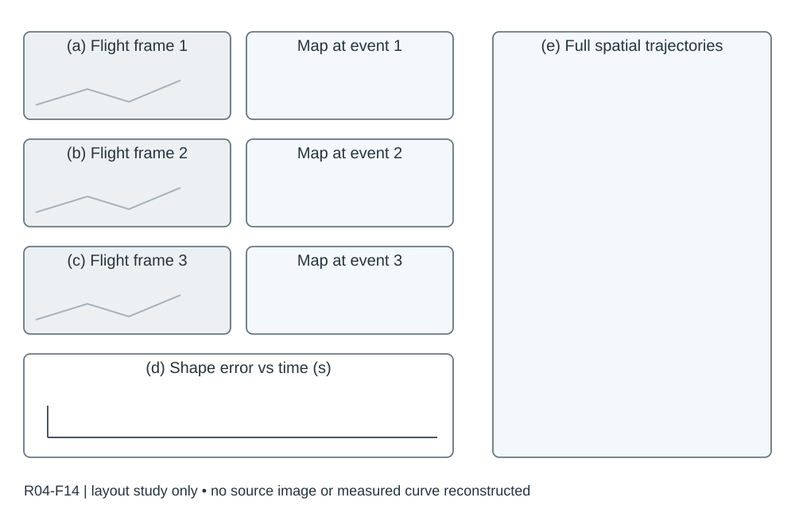

# R04-F14 · Robust and Efficient Trajectory Planning for Formation Flight in Dense Environments

- 原 PDF：`2210.04048v2.pdf`；Fig. 14；PDF 第 16 页（从 1 计，与刊印页码区分）。
- 来源：USER_PREFERRED_29；SHA256：`6a4e6b1a1e67600aa9591afc8a1ad9623f2cedb016f3a5ce82a5d44bf92900d7`。
- 阅读：2026-09-05，Codex AI；KEY_DESIGN_REVIEW。已读页面原图、图注及相关上下文；未逐一转录全部小字。
- [原图所在页](../../../../USER_PREFERRED_VISUAL_LIBRARY/source_pages/R04/page-16.png) · [该页图注与正文](../../../../USER_PREFERRED_VISUAL_LIBRARY/source_pages/R04/p16.txt) · [全文上下文](../../../../USER_PREFERRED_VISUAL_LIBRARY/source_pages/R04/fulltext.txt)

## 论文怎样组织图
几何和优化机制逐层展开，最后将真实飞行、地图轨迹、队形变化和误差合成事件对应的证据；与 R02 有复用内容。

## 图里是什么
a–c左侧三排实景+RViz；d左下相似性误差vs秒及重规划事件；e右侧高幅俯视全轨迹，对应三段队形。

## 它证明什么
同一任务中实景、空间演变、重规划和误差共同解释形变。

## 迁移方式及边界
约左2/3右1/3；事件/颜色/时间统一，是组合图首选范本。

## 原图布局
左侧约三分之二：三行实景与 RViz 配对，下面是队形相似性误差；右侧约三分之一：贯穿高度的俯视轨迹。比例为观察估计。

## 接口、坐标与曲线
实景和地图以 (a)–(c) 对应阶段；(d) 横轴时间 s，纵轴队形相似性误差；(e) 平面空间轨迹。曲线与轨迹必须沿用同一队伍/阶段标记。

## 机制到证据
密集障碍中队形能变形通过并恢复，需要同时看空间轨迹、真实机群及形状误差；仅轨迹不证明队形保持。

## 可执行迁移方案
选一个事先声明选择规则的试验。左上三行各放外部帧与同时间地图，左下画整段队形误差；右侧画全程轨迹与障碍。用三条事件线/编号把阶段定位到误差曲线和轨迹。

## 必须采集什么
trial_id、相机/日志时钟映射、各机位置及 ID、障碍地图、队形误差的定义与参考形状、事件时刻。轨迹图空间轴的具体单位须回查原图，不能从此草图推断。

## 不能照搬什么
R02 与 R04 是相关研究线，复用画法不计作两个独立证据。真实照片不证明全体试验成功。

## 布局草图（分析用，非原图重绘）

## 阅读精度
本条是图级人工编写的 AI 阅读记录，不等于所有坐标刻度、统计定义和正文主张都已逐项复核。关键数字与微小图例用于本稿之前，应打开上方原页；不确定信息不得自动补齐。
