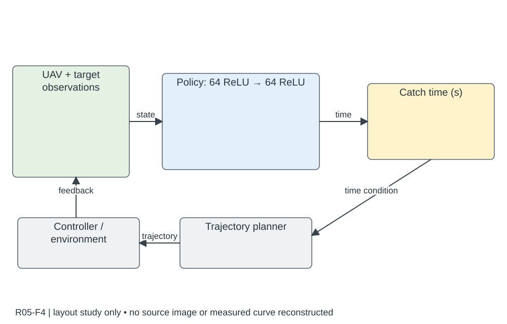

# R05-F4 · Catch Planner: Catching High-Speed Targets in the Flight

- 原 PDF：`2302.04387v2.pdf`；Fig. 4；PDF 第 5 页（从 1 计，与刊印页码区分）。
- 来源：USER_PREFERRED_29；SHA256：`ebe57ec3dd27de3512dd672f9541f32ba0608b692a9a58d5a3027676f4b99251`。
- 阅读：2026-09-05，Codex AI；KEY_DESIGN_REVIEW。已读页面原图、图注及相关上下文；未逐一转录全部小字。
- [原图所在页](../../../../USER_PREFERRED_VISUAL_LIBRARY/source_pages/R05/page-05.png) · [该页图注与正文](../../../../USER_PREFERRED_VISUAL_LIBRARY/source_pages/R05/p05.txt) · [全文上下文](../../../../USER_PREFERRED_VISUAL_LIBRARY/source_pages/R05/fulltext.txt)

## 论文怎样组织图
策略选择捕获时间，优化器产生可飞轨迹；网兜尺寸、动态约束和真实捕获过程共同解释任务可行性，不能把策略动作画成电机指令。

## 图里是什么
左绿观测组→蓝两层64神经元ReLU网络→黄捕获时间动作；下灰轨迹生成/优化/跟随闭环。

## 它证明什么
具体解释RL输入、动作和模型规划关系。

## 迁移方式及边界
可模仿网络+物理回路布局，动作语义必须本稿真实。

## 原图布局
左侧绿色观测向量、中间蓝色两层网络、右侧黄色时间动作；下方规划/控制和环境反馈闭环。

## 接口、坐标与曲线
观测包括无人机位置、速度、姿态和目标位置、速度；网络为两层 64 单元 ReLU；输出捕获时间（秒）。策略之后仍有轨迹优化与跟踪控制。

## 机制到证据
策略决定什么时候捕获，优化器处理怎样飞到捕获点；把时间动作误画成电机输出会彻底改变方法。

## 可执行迁移方案
左 25% 画按对象分组的状态条；中 30% 画真实层数和激活；右 25% 只保留高层动作及单位；下 25% 高度画优化、控制、环境反馈，箭头写时间/轨迹/状态。

## 必须采集什么
本稿的观测字段、实际网络、动作单位/边界、策略更新率和规划重算时刻。不要沿用 64 单元除非实现相同。

## 不能照搬什么
该论文所见图中没有学习曲线；Fig.5 是解析平滑函数，不是奖励收敛。缺图不能变成今后不需要训练证据的理由。

## 布局草图（分析用，非原图重绘）

## 阅读精度
本条是图级人工编写的 AI 阅读记录，不等于所有坐标刻度、统计定义和正文主张都已逐项复核。关键数字与微小图例用于本稿之前，应打开上方原页；不确定信息不得自动补齐。
