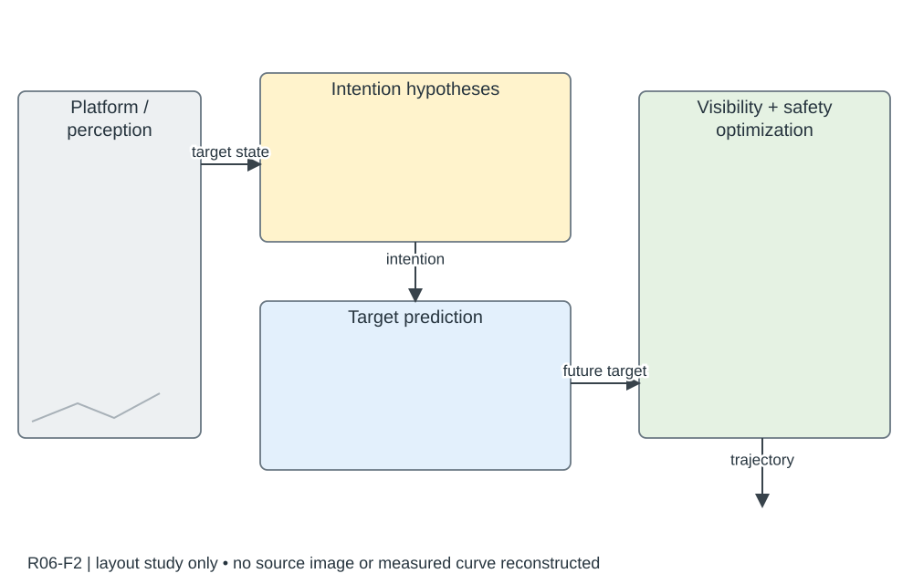

# R06-F2 · Intention-Aware Planner for Robust and Safe Aerial Tracking

- 原 PDF：`2309.08854v4.pdf`；Fig. 2；PDF 第 2 页（从 1 计，与刊印页码区分）。
- 来源：USER_PREFERRED_29；SHA256：`39551aa15e3dee6286734c4cdc83be02e882701ce17576fdbe2272af7708133f`。
- 阅读：2026-09-05，Codex AI；KEY_DESIGN_REVIEW。已读页面原图、图注及相关上下文；未逐一转录全部小字。
- [原图所在页](../../../../USER_PREFERRED_VISUAL_LIBRARY/source_pages/R06/page-02.png) · [该页图注与正文](../../../../USER_PREFERRED_VISUAL_LIBRARY/source_pages/R06/p02.txt) · [全文上下文](../../../../USER_PREFERRED_VISUAL_LIBRARY/source_pages/R06/fulltext.txt)

## 论文怎样组织图
先估计运动意图、再预测目标、最后联合可见性和安全优化；局部几何图解释每项代价怎样改变跟踪行为。

## 图里是什么
左上真机左下感知缩图；右侧黄意图/蓝预测/绿可见性优化分组，黑虚线圆角容器，内部操作缩图。

## 它证明什么
人体意图如何改变预测与可见约束。

## 迁移方式及边界
首选机制框图风格：浅色区域+具体小图+有语义连线。

## 原图布局
左侧平台/感知缩略图；右侧浅黄意图、浅蓝预测、浅绿轨迹优化，虚线圆角分组。

## 接口、坐标与曲线
平台观测→目标状态；目标状态/历史→意图推断→目标预测→轨迹优化→控制。优化区的几何插图明确目标、无人机、障碍和可见性。

## 机制到证据
创新发生在意图驱动预测以及安全/可见性联合优化；预测误差、遮挡事件和安全距离应分别对应验证。

## 可执行迁移方案
左约 20% 放平台和真正输入图，中约 45% 上下放意图及预测，右约 30% 放几何优化和输出轨迹。每个模块附一个与内部运算对应的小图：运动模式、候选未来、视线与障碍。

## 必须采集什么
目标检测/状态估计来源、意图集合、预测时域、优化输入输出、跟踪控制接口、可见性和距离判据。

## 不能照搬什么
不能把普通网络框换名为意图模块；没有意图变量的手稿不能照搬该科学机制。

## 布局草图（分析用，非原图重绘）

## 阅读精度
本条是图级人工编写的 AI 阅读记录，不等于所有坐标刻度、统计定义和正文主张都已逐项复核。关键数字与微小图例用于本稿之前，应打开上方原页；不确定信息不得自动补齐。
