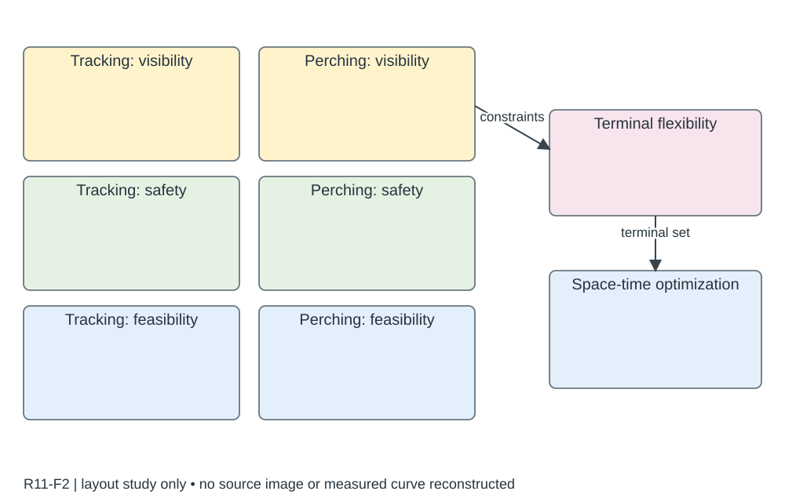

# R11-F2 · Adaptive Tracking and Perching for Quadrotor in Dynamic Scenarios

- 原 PDF：`2312.11866v2.pdf`；Fig. 2；PDF 第 4 页（从 1 计，与刊印页码区分）。
- [仓库原始 PDF](../../../papers/preferred_29/2312.11866v2.pdf#page=4)（可直接下载；下方页面图/正文链接为本地渲染缓存）。
- 来源：USER_PREFERRED_29；SHA256：`d22709ab18b007b6be6e3fb53219d27588b78f607d9b0b76f6778a8b6b0cd23a`。
- 阅读：2026-09-05，Codex AI；KEY_DESIGN_REVIEW。已读页面原图、图注及相关上下文；未逐一转录全部小字。
- [原图所在页](../../../../USER_PREFERRED_VISUAL_LIBRARY/source_pages/R11/page-04.png) · [该页图注与正文](../../../../USER_PREFERRED_VISUAL_LIBRARY/source_pages/R11/p04.txt) · [全文上下文](../../../../USER_PREFERRED_VISUAL_LIBRARY/source_pages/R11/fulltext.txt)

## 论文怎样组织图
跟踪和栖停共享可见性、安全与动力约束，但终端条件不同；通过成对机制图和分阶段实验讲清适应性。

## 图里是什么
左目标估计和无人机传感；中部Tracking/Perching两列×Visibility/Safety/Dynamic feasibility三行，每格几何缩图；右柔性终端与时空优化。

## 它证明什么
把五项挑战映射到不同阶段的具体约束。

## 迁移方式及边界
可模仿能力矩阵式框图；每格必须能指出算法变量。

## 原图布局
左侧 Tracking / Perching 两列，Visibility / Safety / Dynamic feasibility 三行；右侧接终端灵活性和时空优化。每格是几何小图。

## 接口、坐标与曲线
两列共用目标、无人机和障碍语义；跟踪和栖停不能共享未经区分的终端位置/姿态约束。这里无统计坐标轴。

## 机制到证据
同一个场景切换任务后，可见性、安全和可行性约束如何变化，是方法动机；右侧机制要接住这些变化。

## 可执行迁移方案
需要比较两个任务时，用左 65% 的 2×3 几何矩阵替代六个文字盒；右 30% 把终端约束与优化模块纵排。格内画视线、距离、速度/姿态限制，不能只写标签。

## 必须采集什么
两任务的终端状态集合、障碍/目标几何、视场定义和动力学约束。

## 不能照搬什么
此草图只标占位；最终应绘制本稿几何，不把跟踪/栖停名称迁移到不相关任务。

## 布局草图（分析用，非原图重绘）

## 阅读精度
本条是图级人工编写的 AI 阅读记录，不等于所有坐标刻度、统计定义和正文主张都已逐项复核。关键数字与微小图例用于本稿之前，应打开上方原页；不确定信息不得自动补齐。
