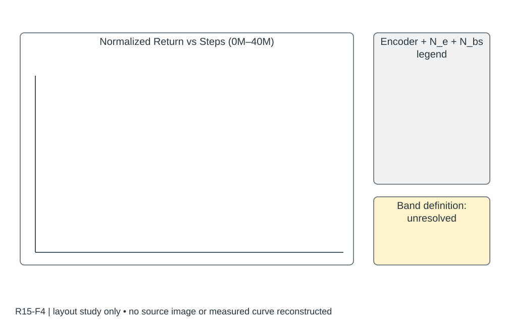

# R15-F4 · Flying on Point Clouds with Reinforcement Learning

- 原 PDF：`2503.00496v1.pdf`；Fig. 4；PDF 第 5 页（从 1 计，与刊印页码区分）。
- 来源：USER_PREFERRED_29；SHA256：`0953bdddab2df769078eea37840a35cc013363144b9985837c8bf2d075729d3f`。
- 阅读：2026-09-05，Codex AI；KEY_DESIGN_REVIEW。已读页面原图、图注及相关上下文；未逐一转录全部小字。
- [原图所在页](../../../../USER_PREFERRED_VISUAL_LIBRARY/source_pages/R15/page-05.png) · [该页图注与正文](../../../../USER_PREFERRED_VISUAL_LIBRARY/source_pages/R15/p05.txt) · [全文上下文](../../../../USER_PREFERRED_VISUAL_LIBRARY/source_pages/R15/fulltext.txt)

## 论文怎样组织图
点云编码直接服务飞行控制，以编码器/训练配置比较、未见环境和真实飞行连接表示学习与部署；训练阴影定义未确认。

## 图里是什么
单训练图，多配置彩线和带；x0–40M steps、yNormalized Return；表示/并行环境N_e/mini-batch N_b组合。

## 它证明什么
展示表示压缩和批量数据使PPO更容易训练。

## 迁移方式及边界
带的统计定义和seed数不能从外观推断，须查正文；不要把mini-batch当独立seed。

## 原图布局
单轴多曲线，白底、浅网格、透明色带；图例将编码器和并行环境/批量配置一起写出。

## 接口、坐标与曲线
原图 x: Steps，0M–40M；y: Normalized Return，图注又称 undiscounted return。图例包括 Ours、2DCNN、3DCNN 及 N_e、N_bs。Steps 的累计口径、归一化公式、色带统计含义未由已读图注确认。

## 机制到证据
点云编码能否提高学习效率，与并行环境数和训练批量混在同一对比中；读者必须知道哪些比较控制了训练预算。

## 可执行迁移方案
若目标是编码器比较，先固定训练协议，在图例区分编码器；若目标是训练规模，再单独分面比较环境数。主轴优先累计环境步数，补充墙钟时间及硬件。明确种子级聚合和不确定性。

## 必须采集什么
seed、env_steps、update_idx、wall_time_s、return_raw、reward_version、encoder、num_envs、batch_size；归一化基准、平滑窗口和色带公式必须提供。

## 不能照搬什么
不能默认原图阴影是 95% CI，也不能把 1024 个并行环境当作 1024 个独立随机种子。

## 布局草图（分析用，非原图重绘）

## 阅读精度
本条是图级人工编写的 AI 阅读记录，不等于所有坐标刻度、统计定义和正文主张都已逐项复核。关键数字与微小图例用于本稿之前，应打开上方原页；不确定信息不得自动补齐。
