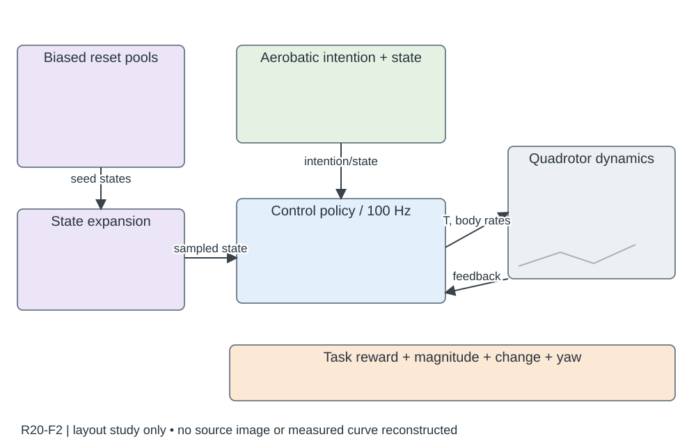

# R20-F2 · Reactive Aerobatic Flight via Reinforcement Learning

- 原 PDF：`2505.24396v1.pdf`；Fig. 2；PDF 第 4 页（从 1 计，与刊印页码区分）。
- 来源：USER_PREFERRED_29；SHA256：`ff6d412e73acc385875c9e5208b1dbe5b4be7637552d34c095eb94c11a50fbe0`。
- 阅读：2026-09-05，Codex AI；KEY_DESIGN_REVIEW。已读页面原图、图注及相关上下文；未逐一转录全部小字。
- [原图所在页](../../../../USER_PREFERRED_VISUAL_LIBRARY/source_pages/R20/page-04.png) · [该页图注与正文](../../../../USER_PREFERRED_VISUAL_LIBRARY/source_pages/R20/p04.txt) · [全文上下文](../../../../USER_PREFERRED_VISUAL_LIBRARY/source_pages/R20/fulltext.txt)

## 论文怎样组织图
偏置重置与状态扩展改变训练分布，动作意图和飞行状态进入策略；共同初态/原始奖励下评价以避免奖励修改造成假优势。

## 图里是什么
上淡蓝Training Pipeline：左偏置重置池甜甜圈+状态扩展小图，中绿意图/状态，蓝MLP100Hz→无人机及反馈；下淡橙四项奖励。

## 它证明什么
核心是采样初态课程而非换奖励；动作推力+角速度。

## 迁移方式及边界
偏置池、种子回收、扩展方向不能省成Curriculum盒子。

## 原图布局
浅蓝外层 Training Pipeline；左紫色重置池和状态扩展，上中绿色意图/状态，下中蓝色策略网络，右侧四旋翼；底部紫色飞行动作与橙色奖励条。

## 接口、坐标与曲线
重置池→状态扩展→采样状态；意图与飞行状态→策略；策略以 100 Hz 输出归一化推力和机体系角速度。seed points 回到扩展池，previous action 回到策略输入。

## 机制到证据
策略形状并非唯一创新：可到达状态的扩展和重置分布让稀疏成功信号可学习。对应消融应改变采样机制并在共同起点和共同奖励下评价。

## 可执行迁移方案
把新增采样路径放左侧独立紫色容器，用起始状态散点/可达扩展小图替代抽象模块；主策略闭环居中，底部将原任务奖励与动作正则分开列。箭头标采样状态、动作、回放状态。

## 必须采集什么
重置池定义和更新规则、各采样概率、状态字段、动作归一化及频率、奖励分项、评估起始集。示意中的比例不得凭视觉面积猜测。

## 不能照搬什么
Fig.1 是 Blender 渲染的任务说明，不是实飞长曝光照片；本例动作接口不适用于 R25 的姿态参考动作。

## 布局草图（分析用，非原图重绘）

## 阅读精度
本条是图级人工编写的 AI 阅读记录，不等于所有坐标刻度、统计定义和正文主张都已逐项复核。关键数字与微小图例用于本稿之前，应打开上方原页；不确定信息不得自动补齐。
