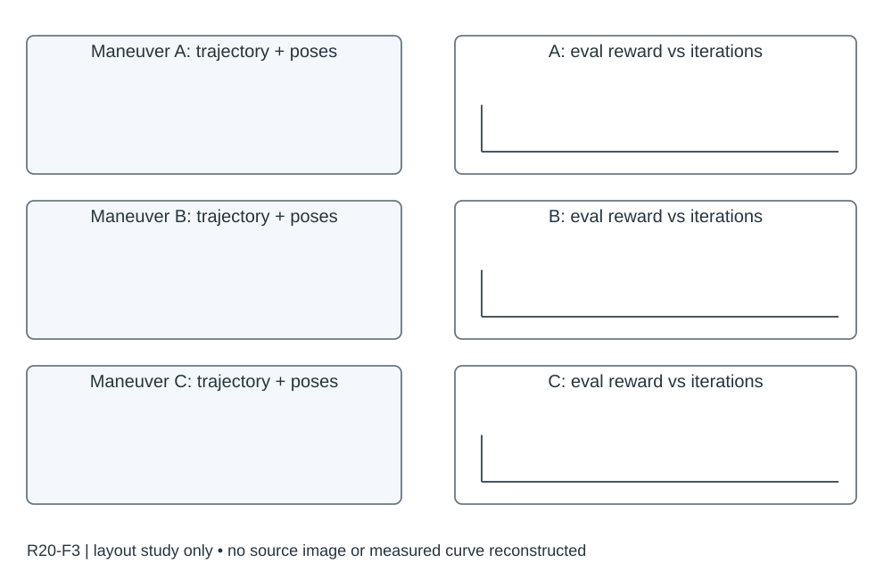

# R20-F3 · Reactive Aerobatic Flight via Reinforcement Learning

- 原 PDF：`2505.24396v1.pdf`；Fig. 3；PDF 第 6 页（从 1 计，与刊印页码区分）。
- [仓库原始 PDF](../../../papers/preferred_29/2505.24396v1.pdf#page=6)（可直接下载；下方页面图/正文链接为本地渲染缓存）。
- 来源：USER_PREFERRED_29；SHA256：`ff6d412e73acc385875c9e5208b1dbe5b4be7637552d34c095eb94c11a50fbe0`。
- 阅读：2026-09-05，Codex AI；KEY_DESIGN_REVIEW。已读页面原图、图注及相关上下文；未逐一转录全部小字。
- [原图所在页](../../../../USER_PREFERRED_VISUAL_LIBRARY/source_pages/R20/page-06.png) · [该页图注与正文](../../../../USER_PREFERRED_VISUAL_LIBRARY/source_pages/R20/p06.txt) · [全文上下文](../../../../USER_PREFERRED_VISUAL_LIBRARY/source_pages/R20/fulltext.txt)

## 论文怎样组织图
偏置重置与状态扩展改变训练分布，动作意图和飞行状态进入策略；共同初态/原始奖励下评价以避免奖励修改造成假优势。

## 图里是什么
三行PowerLoop/Split-S/BarrelRoll；左姿态角着色轨迹和移动目标红圈，右平均回报vs学习迭代三策略线。

## 它证明什么
自动课程加快学习，并形成目标动作。

## 迁移方式及边界
正文用相同初始分布及原始奖励评价SP/RS/本文，避免异奖励数值直接比；未声明的seed/带勿补造。

## 原图布局
三行特技动作，左列三维轨迹/沿途姿态，右列 Average Reward—Learning Iterations 曲线，同行对应同一动作。

## 接口、坐标与曲线
右列 Proposed / SP / RS，共同的 S_start 初始状态集以及原始奖励 Eq.(3) 下评价；左列位置与姿态是空间变量，不能与训练迭代共用轴。

## 机制到证据
偏置采样让不同动作可学习；空间图展示最终行为，学习曲线展示不同机制的训练差异。共同评价奖励使重塑奖励的基线可比较。

## 可执行迁移方案
每个任务一行，左 45% 画代表轨迹和稀疏姿态，右 50% 画固定协议评估回报。行标题命名动作，方法颜色跨行固定。三行太密时正文保留两种关键动作，其余入补充。

## 必须采集什么
共同 evaluation_initial_set、eval_reward_version、seed、训练迭代到环境步数的换算、每次评估试验数、checkpoint、代表轨迹的选择规则。

## 不能照搬什么
若训练奖励不同，不能直接把各自训练回报放一起宣布性能提升。左侧成功样例不代表成功率。

## 布局草图（分析用，非原图重绘）

## 阅读精度
本条是图级人工编写的 AI 阅读记录，不等于所有坐标刻度、统计定义和正文主张都已逐项复核。关键数字与微小图例用于本稿之前，应打开上方原页；不确定信息不得自动补齐。
