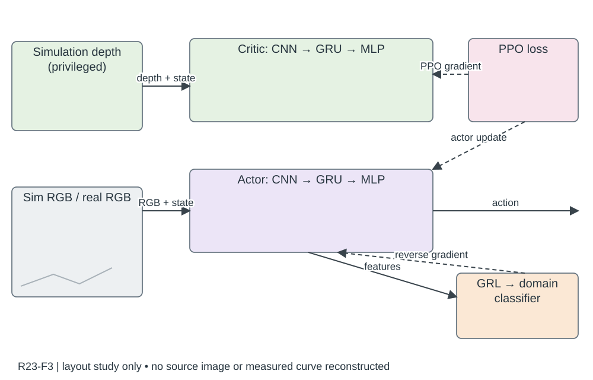

# R23-F3 · Flying in Clutter on Monocular RGB by Learning in 3D Radiance Fields with Domain Adaptation

- 原 PDF：`2512.17349v1.pdf`；Fig. 3；PDF 第 4 页（从 1 计，与刊印页码区分）。
- 来源：USER_PREFERRED_29；SHA256：`4c4a38bc2f963987f8d120483b0c988cbcaa49f0f992af81dbae33e257debdcc`。
- 阅读：2026-09-05，Codex AI；KEY_DESIGN_REVIEW。已读页面原图、图注及相关上下文；未逐一转录全部小字。
- [原图所在页](../../../../USER_PREFERRED_VISUAL_LIBRARY/source_pages/R23/page-04.png) · [该页图注与正文](../../../../USER_PREFERRED_VISUAL_LIBRARY/source_pages/R23/p04.txt) · [全文上下文](../../../../USER_PREFERRED_VISUAL_LIBRARY/source_pages/R23/fulltext.txt)

## 论文怎样组织图
训练用特权深度 critic 与域分类器，部署只用 RGB actor；域适应的反向梯度和实/仿真数据路径必须显式。

## 图里是什么
左仿真状态和3DGS/真实图像，中绿critic和紫actor CNN→GRU→MLP，下域分类器/GRL反向梯度，右潜空间；实线前向虚线回传。

## 它证明什么
深度特权只给critic，域适应只影响编码训练。

## 迁移方式及边界
动作T/姿态角；部署不能偷用深度critic或真实标签。

## 原图布局
左侧物理仿真、3DGS RGB、实拍 RGB 和深度来源；中间上绿 critic、下紫 actor；右下橙 GRL 与域分类器，顶部红虚线 PPO 梯度，灰色外框。

## 接口、坐标与曲线
训练 critic 用特权深度，actor 用单目 RGB；CNN→GRU→MLP，状态向量按图进入网络；actor features→GRL→domain classifier，反向梯度回到特征编码器。正向黑实线，反传彩色虚线。

## 机制到证据
域适应在表征而非执行端添加一个神奇纠错盒；特权信息不能沿箭头泄漏到部署 actor。对应消融需隔离 DR、DA 与动力随机化。

## 可执行迁移方案
左 20% 画真实数据来源缩略图，中 55% 双行网络，右 20% 画输出/损失；域分类器靠近 actor 特征抽取点。用训练专用浅底区域括住 critic、PPO 和域损失，单独给部署路径。

## 必须采集什么
RGB/深度分辨率与通道、状态字段、特征抽取层、GRL 梯度方向、sim/real 数据划分、动作单位、部署可用输入；不得混入测试场景做适配却称未见泛化。

## 不能照搬什么
预训练再做适配的曲线不是从零同预算训练；Fig.4 的 DR+DA+DY 初始化来源要随图说明。图中的实拍数据不表示在线实机 RL 更新。

## 布局草图（分析用，非原图重绘）

## 阅读精度
本条是图级人工编写的 AI 阅读记录，不等于所有坐标刻度、统计定义和正文主张都已逐项复核。关键数字与微小图例用于本稿之前，应打开上方原页；不确定信息不得自动补齐。
