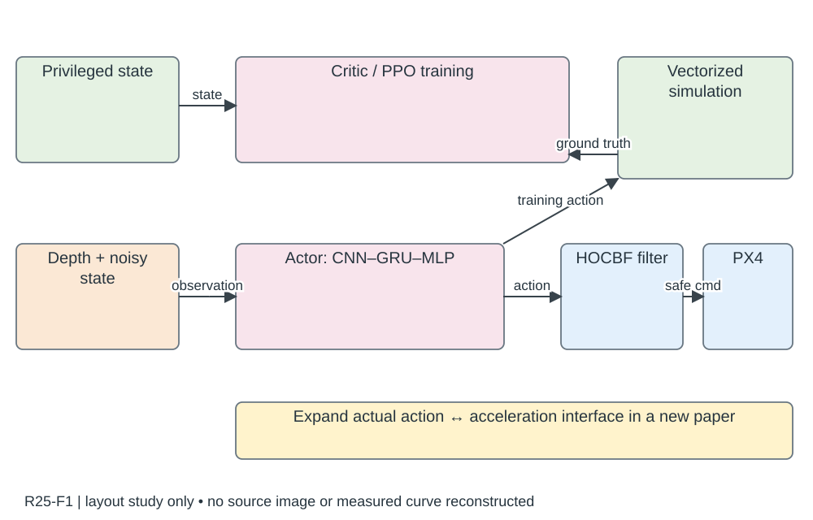

# R25-F1 · High-Speed Vision-Based Flight in Clutter with Safety-Shielded Reinforcement Learning

- 原 PDF：`2602.08653v2.pdf`；Fig. 1；PDF 第 3 页（从 1 计，与刊印页码区分）。
- 来源：USER_PREFERRED_29；SHA256：`eb95baaebb709d3fb89afdbf60ba907cd3db380ee0819ab9a03b7261132cd53a`。
- 阅读：2026-09-05，Codex AI；KEY_DESIGN_REVIEW。已读页面原图、图注及相关上下文；未逐一转录全部小字。
- [原图所在页](../../../../USER_PREFERRED_VISUAL_LIBRARY/source_pages/R25/page-03.png) · [该页图注与正文](../../../../USER_PREFERRED_VISUAL_LIBRARY/source_pages/R25/p03.txt) · [全文上下文](../../../../USER_PREFERRED_VISUAL_LIBRARY/source_pages/R25/fulltext.txt)

## 论文怎样组织图
训练奖励中的 CBF 与部署 HOCBF 过滤器是两个位置的机制，必须区分；训练成功率不能代替部署安全与速度评估。

## 图里是什么
左粉非对称actor/critic：CNN→GRU→MLP；中sim/real+控制器，HOCBF滤波支路，训练/部署彩箭头，反传红虚线。

## 它证明什么
训练奖励软引导与部署QP硬修正分工。

## 迁移方式及边界
必须画原动作→参考加速度→安全投影→控制指令的转换，原图简写不能成为接口歧义。

## 原图布局
上/中 actor–critic 粉色分区，CNN 灰梯形、GRU 绿矩形、MLP 粉三角；右侧绿色训练闭环和蓝色部署闭环；部署在 actor 与 PX4 间插 HOCBF。

## 接口、坐标与曲线
actor 动作为归一化推力 f_n 和 roll/pitch/yaw 参考（100 Hz），并非机体系角速度；训练有特权状态、actor 观测噪声/丢失。正文过滤器在参考加速度上求解，图中未展开动作↔加速度接口。

## 机制到证据
Dijkstra/CBF 训练引导提高学到有效导航的机会；HOCBF 部署修改不安全指令。必须分别测学习效率、实际碰撞/约束违反、过滤器干预量与成本。

## 可执行迁移方案
用上下两条泳道明确训练/部署，突出新增过滤器。新稿必须展开 policy action→参考加速度→QP/HOCBF→控制指令的实际映射；若本稿直接输出加速度则无需虚构转换盒。

## 必须采集什么
动作语义和限幅、坐标系、控制频率、参考加速度转换、障碍状态、h 与高阶条件、QP slack/不可行恢复、部署计算平台。

## 不能照搬什么
源图的接口省略不应被照搬。CBF 名称不是实机零碰撞或形式安全保证；保证依赖模型、相对阶、估计和可行性假设。

## 布局草图（分析用，非原图重绘）

## 阅读精度
本条是图级人工编写的 AI 阅读记录，不等于所有坐标刻度、统计定义和正文主张都已逐项复核。关键数字与微小图例用于本稿之前，应打开上方原页；不确定信息不得自动补齐。
