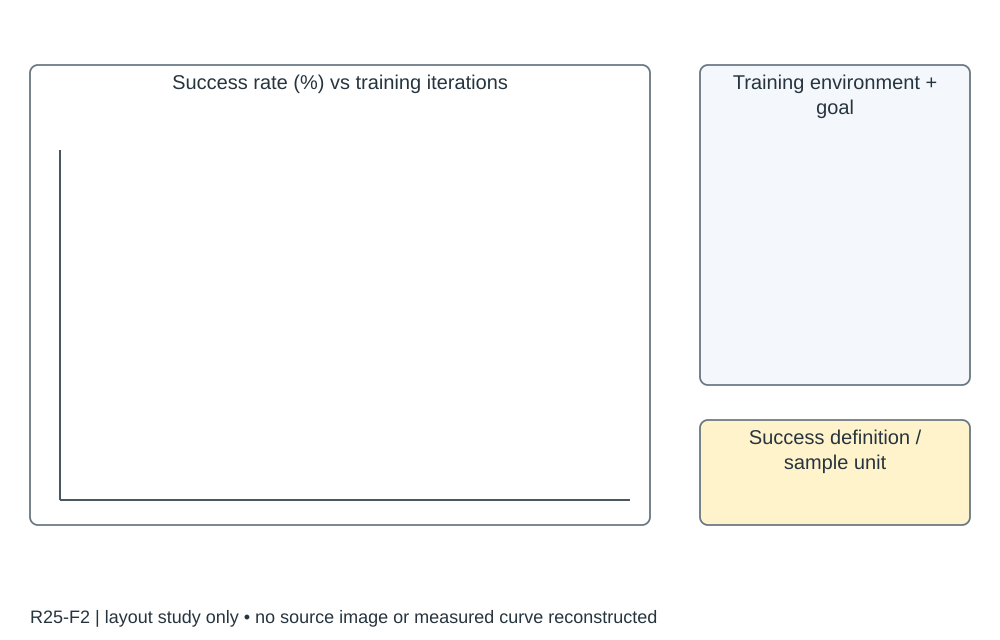

# R25-F2 · High-Speed Vision-Based Flight in Clutter with Safety-Shielded Reinforcement Learning

- 原 PDF：`2602.08653v2.pdf`；Fig. 2；PDF 第 5 页（从 1 计，与刊印页码区分）。
- [仓库原始 PDF](../../../papers/preferred_29/2602.08653v2.pdf#page=5)（可直接下载；下方页面图/正文链接为本地渲染缓存）。
- 来源：USER_PREFERRED_29；SHA256：`eb95baaebb709d3fb89afdbf60ba907cd3db380ee0819ab9a03b7261132cd53a`。
- 阅读：2026-09-05，Codex AI；KEY_DESIGN_REVIEW。已读页面原图、图注及相关上下文；未逐一转录全部小字。
- [原图所在页](../../../../USER_PREFERRED_VISUAL_LIBRARY/source_pages/R25/page-05.png) · [该页图注与正文](../../../../USER_PREFERRED_VISUAL_LIBRARY/source_pages/R25/p05.txt) · [全文上下文](../../../../USER_PREFERRED_VISUAL_LIBRARY/source_pages/R25/fulltext.txt)

## 论文怎样组织图
训练奖励中的 CBF 与部署 HOCBF 过滤器是两个位置的机制，必须区分；训练成功率不能代替部署安全与速度评估。

## 图里是什么
a左成功率%vsTraining Iterations，Distance/Dijkstra/Dijkstra+CBF三线；b右密集训练环境。

## 它证明什么
证明奖励结构改变学习效率。

## 迁移方式及边界
这是训练成功率非回报，单纯多环境不是多随机种子。

## 原图布局
左侧 Success Rate (%)—Training Iterations，右侧仿真场景图；Distance、Dijkstra、Dijkstra+CBF 三条方法曲线。

## 接口、坐标与曲线
横轴训练迭代数，纵轴成功率百分数；正文训练任务采用进入目标周围 5 m 球的成功定义。并行仿真环境数不是随机种子数。

## 机制到证据
奖励引导改变学习过程，而右侧场景解释学习问题的难度；需要另图报告更严格部署任务及安全性。

## 可执行迁移方案
左 65% 放共同定义下的成功率学习曲线，右 30% 放训练环境及起终点；明确评估还是训练滚动统计、窗口、样本数与 seed。若部署阈值不同在图注直接指出。

## 必须采集什么
iteration、env_steps、seed、eval_or_train、episodes、successes、goal_radius_m、scene_set、reward_variant；不同算法固定采样预算或同时给换算。

## 不能照搬什么
训练中进入 5 m 球的成功率不能改称最终精确到达率；本图不是碰撞率或安全证明。

## 布局草图（分析用，非原图重绘）

## 阅读精度
本条是图级人工编写的 AI 阅读记录，不等于所有坐标刻度、统计定义和正文主张都已逐项复核。关键数字与微小图例用于本稿之前，应打开上方原页；不确定信息不得自动补齐。
