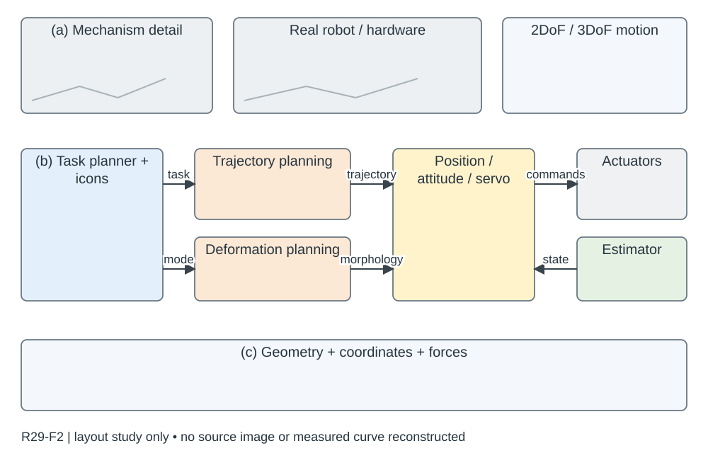

# R29-F2 · Hand-like autonomous flying robot for airborne grasping and interaction

- 原 PDF：`s41467-026-68967-3.pdf`；Fig. 2；PDF 第 4 页（从 1 计，与刊印页码区分）。
- [仓库原始 PDF](../../../papers/preferred_29/s41467-026-68967-3.pdf#page=4)（可直接下载；下方页面图/正文链接为本地渲染缓存）。
- 来源：USER_PREFERRED_29；SHA256：`114055a773ccadd35cb08d724cf7652830a6a4591b86146a0a26b4f12b6d9782`。
- 阅读：2026-09-05，Codex AI；KEY_DESIGN_REVIEW。已读页面原图、图注及相关上下文；未逐一转录全部小字。
- [原图所在页](../../../../USER_PREFERRED_VISUAL_LIBRARY/source_pages/R29/page-04.png) · [该页图注与正文](../../../../USER_PREFERRED_VISUAL_LIBRARY/source_pages/R29/p04.txt) · [全文上下文](../../../../USER_PREFERRED_VISUAL_LIBRARY/source_pages/R29/fulltext.txt)

## 论文怎样组织图
手式机构、任务规划、形变与控制形成完整操作链；实景事件与误差/外力/舵机状态对应，Nature 风格可以迁移到 IEEE 图。

## 图里是什么
a硬件拆分/2DoF扭转3DoF伸缩；b蓝任务—橙规划—黄控制—绿估计；c形变几何、坐标和受力。

## 它证明什么
硬件软件和物理模型统一解释自主操作。

## 迁移方式及边界
首选浅色分层框图；把图案与模块绑定。

## 原图布局
纵向三带：(a) 硬件约 30%，(b) 软件约 45%，(c) 动力学约 25%。细黑分区边框与标题缺口，浅蓝任务、浅橙规划、浅黄控制、浅绿估计，正交连线。

## 接口、坐标与曲线
硬件中心为真实平台并配机构局部与 2DoF/3DoF 示意；软件任务→轨迹/形变规划→位置/姿态/舵机控制→执行器，估计量反馈；底部形变几何、坐标系与受力。

## 机制到证据
手式构型如何改变飞行和操作能力，不能被一个通用 planner/controller 流程替代。独立的形变指令及其执行路径是这张图的辨识点。

## 可执行迁移方案
硬件论文用三带结构，控制/RL 论文可以只借软件带。规划拆成飞行与形变两支，执行器分推力电机与形变驱动；每个任务小图标必须对应真实支持任务。浅色背景帮助分组，黑箭头承载接口。

## 必须采集什么
机构自由度、实际传感器/执行器、轨迹与形变命令、估计状态、坐标/受力符号及任务自主程度。

## 不能照搬什么
Nature 的纵向整页信息密度不能直接压进 IEEE 单栏；需减少面板或用双栏。颜色是观察到的色系，不声称提取了出版源文件的精确色值。

## 布局草图（分析用，非原图重绘）

## 阅读精度
本条是图级人工编写的 AI 阅读记录，不等于所有坐标刻度、统计定义和正文主张都已逐项复核。关键数字与微小图例用于本稿之前，应打开上方原页；不确定信息不得自动补齐。
