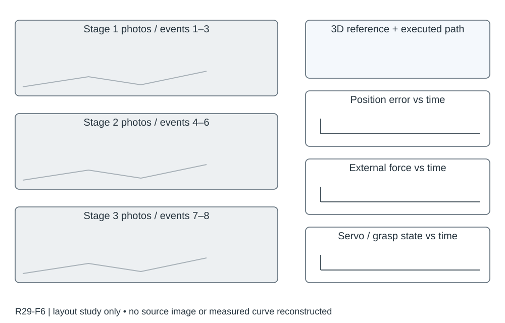

# R29-F6 · Hand-like autonomous flying robot for airborne grasping and interaction

- 原 PDF：`s41467-026-68967-3.pdf`；Fig. 6；PDF 第 9 页（从 1 计，与刊印页码区分）。
- 来源：USER_PREFERRED_29；SHA256：`114055a773ccadd35cb08d724cf7652830a6a4591b86146a0a26b4f12b6d9782`。
- 阅读：2026-09-05，Codex AI；KEY_DESIGN_REVIEW。已读页面原图、图注及相关上下文；未逐一转录全部小字。
- [原图所在页](../../../../USER_PREFERRED_VISUAL_LIBRARY/source_pages/R29/page-09.png) · [该页图注与正文](../../../../USER_PREFERRED_VISUAL_LIBRARY/source_pages/R29/p09.txt) · [全文上下文](../../../../USER_PREFERRED_VISUAL_LIBRARY/source_pages/R29/fulltext.txt)

## 论文怎样组织图
手式机构、任务规划、形变与控制形成完整操作链；实景事件与误差/外力/舵机状态对应，Nature 风格可以迁移到 IEEE 图。

## 图里是什么
左三长实景阶段含①–⑧；右3D参考、三轴ATE、外力与舵角/抓握状态曲线。

## 它证明什么
连续多任务交互中切换抓握模式并保持飞行精度。

## 迁移方式及边界
同事件编号跨照片与曲线，是实飞综合图重点范本。

## 原图布局
左侧三条长实景序列包含 ①–⑧，右侧三维参考轨迹和多行诊断曲线；曲线包括三轴 ATE、外力、舵角/抓握状态。

## 接口、坐标与曲线
三维图用空间位置；诊断图横轴共享任务时间，纵轴各自为误差/力/舵角或离散模式。图中每个事件用照片和日志一起定位。

## 机制到证据
飞行中切换抓握形态时如何保持精度，并响应真实接触/交互外力，是可观察机制；单一位置误差无法说明模式切换。

## 可执行迁移方案
左约 55% 放三阶段叠影，右约 40% 自上而下放路径、误差、外力和模式；照片里圈出关键接触对象，曲线上用相同编号和竖线。只把同一次试验放在共同时间轴。

## 必须采集什么
原始视频和帧号、统一日志时间、参考/实测位置、外力是测量还是估计、舵机角/抓握模式、接触事件和姿态、选定试验规则。

## 不能照搬什么
若暂无实拍或力估计，留空对应面板并写 NEEDS_EXPERIMENT；不能用生成图片或虚构曲线填满。

## 布局草图（分析用，非原图重绘）

## 阅读精度
本条是图级人工编写的 AI 阅读记录，不等于所有坐标刻度、统计定义和正文主张都已逐项复核。关键数字与微小图例用于本稿之前，应打开上方原页；不确定信息不得自动补齐。
