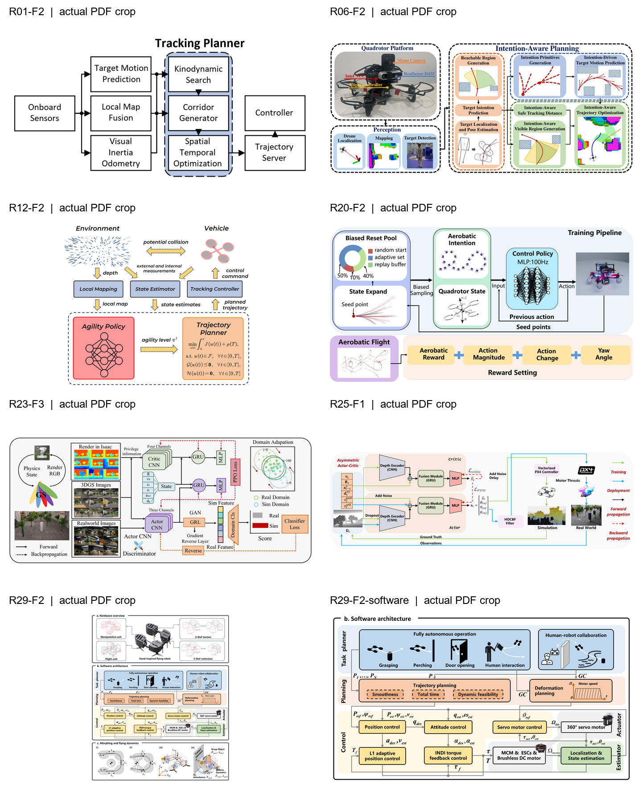

# Preferred framework appearance anchors

本库保存真实 PDF 框架图裁图及量化外观卡。旧 `sketches/*.svg` 是结构分析草图，不能充当外观范本。

选择匹配方法复杂度和表现语法的一个主锚点，最多一个辅助锚点。先看原图裁图，后写视觉规范；不用六类风格混合成通用流程图。

[原图区别、优势与选型诊断](SELECTION_AND_CRITIQUE.md)；[局部机制画法原型](../mechanism_patterns/INDEX.md)

| Anchor | Family | Ratio | Actual source |
|---|---|---:|---|
| [R01-F2](R01-F2.md) | compact-single-column-system | 2.06 | [2011.03968v1.pdf](../../../papers/preferred_29/2011.03968v1.pdf#page=2) Fig. 2, PDF p. 2 |
| [R06-F2](R06-F2.md) | nested-mechanism-card-system | 2.32 | [2309.08854v4.pdf](../../../papers/preferred_29/2309.08854v4.pdf#page=2) Fig. 2, PDF p. 2 |
| [R12-F2](R12-F2.md) | compact-hierarchical-policy-planner | 1.19 | [2403.04586v2.pdf](../../../papers/preferred_29/2403.04586v2.pdf#page=3) Fig. 2, PDF p. 3 |
| [R20-F2](R20-F2.md) | training-loop-with-mechanism-and-reward-strip | 1.96 | [2505.24396v1.pdf](../../../papers/preferred_29/2505.24396v1.pdf#page=4) Fig. 2, PDF p. 4 |
| [R23-F3](R23-F3.md) | network-data-domains-and-gradient-paths | 2.40 | [2512.17349v1.pdf](../../../papers/preferred_29/2512.17349v1.pdf#page=4) Fig. 3, PDF p. 4 |
| [R25-F1](R25-F1.md) | asymmetric-network-training-deployment-control | 3.13 | [2602.08653v2.pdf](../../../papers/preferred_29/2602.08653v2.pdf#page=3) Fig. 1, PDF p. 3 |
| [R29-F2](R29-F2.md) | hardware-software-dynamics-multipanel | 0.82 | [s41467-026-68967-3.pdf](../../../papers/preferred_29/s41467-026-68967-3.pdf#page=4) Fig. 2, PDF p. 4 |
| [R29-F2-software](R29-F2-software.md) | horizontal-functional-bands-software | 1.78 | [s41467-026-68967-3.pdf](../../../papers/preferred_29/s41467-026-68967-3.pdf#page=4) Fig. 2, PDF p. 4 |

## 复现与核验

`python scripts/prepare_framework_anchors.py --skill-root .` 从 hash 匹配的原 PDF 重建 300 dpi 裁图、配色采样、坐标归一化和卡片。

`python scripts/prepare_framework_anchors.py --skill-root . --check` 验证来源 hash、裁框、图片 hash/尺寸、非空性、区域坐标与图注排除。

JSON 只给测量过的外观规范；没有宣称这些论文共用某个唯一 IEEE 风格。R29 为 Nature Communications 图例，完整竖图与 software 子图须区别使用。

颜色为渲染近似值；字体分为 PDF 文本可提取与 raster/outlined 视觉观察；内部 raster 边界保留测量容差。
