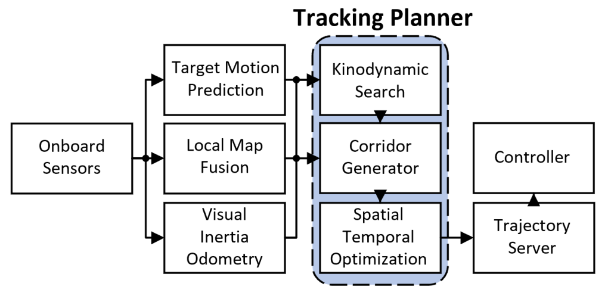

# R01-F2 — 原图外观锚点

**Fast-Tracker: A Robust Aerial System for Tracking Agile Target in Cluttered Environments**

- 原 PDF：[2011.03968v1.pdf](../../../papers/preferred_29/2011.03968v1.pdf#page=2)；Fig. 2；PDF 第 2 页（1-based）。
- SHA256：`324582130c16f88a5ad890e37fe9b198352ff17f490836d6025fecdbeb501fb1`。
- 本图：**SOURCE_FAITHFUL_CROP**，直接裁自原 PDF，不是重绘、AI 生成图或旧布局草图。
- 裁框（PDF pt，左上原点）：`[313.2, 54.0, 557.99, 173.07]`；宽高比 `2.05585`；300 dpi；1020×497 px。
- 测量依据：Embedded source raster placement is exact; internal boundaries measured visually against the source raster, tolerance about 1.5 pt.

## 选择与外观特征

家族：`compact-single-column-system`。

- Single-column aspect ratio about 2.06
- Five functional columns, with the third algorithm column highlighted
- Three vertical white boxes inside one tinted dashed planner group
- Compact black-and-white system appearance

## 分区与几何

坐标为相对当前裁图的归一化 `[x0,y0,x1,y1]`。它描述外观，不强制新方法具有源论文的模块。

| 区域 | 父区域 | 归一化边界 | 原图形状 |
|---|---|---|---|
| sensors (input) | — | `[0.01961, 0.41992, 0.21978, 0.65508]` | unfilled thin rectangle |
| state_processing (parallel estimation) | — | `[0.2688, 0.15117, 0.46897, 0.93222]` | three vertically stacked unfilled rectangles |
| planner (core group) | — | `[0.51391, 0.12598, 0.73859, 0.96582]` | light blue-gray rounded group with black dashed perimeter |
| planner_stages (three serial stages) | planner | `[0.52617, 0.15117, 0.72634, 0.93222]` | three white rectangles with narrow vertical gaps |
| actuation (output and feedback) | — | `[0.77944, 0.41992, 0.9837, 0.93222]` | two stacked white rectangles |

## 配色、字体与线条

颜色样本是该 PDF 以所列分辨率渲染后的 RGB 近似；包含色彩管理、透明叠色和抗锯齿影响。vector_rgb/opacity 是 PDF 图形中的数值，不能把原始 fill 直接当最终显示色。

| 部位 | 渲染样本 | 源 fill / opacity（若可取得） | 证据 |
|---|---|---|---|
| planner tint | `#B7C8E8` | raster / 不可反推源颜色 | median rendered pixel sample; source is raster |

字体证据：visual observation, raster labels are not recoverable PDF fonts。Regular sans-serif labels; group heading bold sans-serif. Black labels inside compact boxes, generally 1-3 short lines. The serif IEEE caption is outside the anchor.

Use this compact sans-serif family when selecting R01; do not impose the serif labels of R06/R23 on it.

## 连线与机制小图

Thin black solid arrows, orthogonal fan-out bus after the sensor box, orthogonal bus feeding the planner; vertical arrows through three planner stages; trajectory server points up to controller.

Line exits meet box edges; no rounded connector ornaments, numbered steps, gradient strokes, or arrow badges.

Most arrows are unlabelled in this small source diagram; add essential interface labels only when the new method needs them.

源图小图：No platform photo, neural network glyph, miniature plot, or geometry vignette appears in this framework.

This is the useful compact alternative when a real system can be explained by its interfaces and three algorithm stages.

## 可迁移边界与失败模式

Copy the geometry and sparse appearance. Replace sensing, prediction, search, corridor, optimization and control interfaces with the actual project modules; these source algorithms are not automatically requirements for a new method.

避免：A full-width generic pastel pipeline with icons would not look like this source. Neither would making every group equally large or equally colored.

## 使用时的视觉核验

同时打开本原图裁图和新稿渲染。先对照整体比例/分区占比，再对照嵌套层级、模块形状、颜色透明度、字体层级、机制小图和箭头语法。旧 sketches/*.svg 仅是结构分析草图，不参与原图外观验收。

新稿需保留可编辑文字与矢量模块；源图裁图是参考材料，不能作为冒充原创方法图或实验结果的输出。
