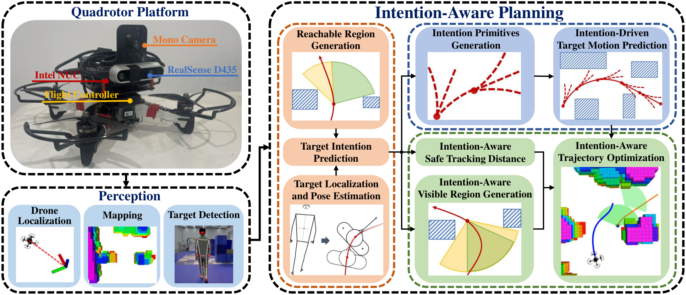

# R06-F2 — 原图外观锚点

**Intention-Aware Planner for Robust and Safe Aerial Tracking**

- 原 PDF：[2309.08854v4.pdf](../../../papers/preferred_29/2309.08854v4.pdf#page=2)；Fig. 2；PDF 第 2 页（1-based）。
- SHA256：`39551aa15e3dee6286734c4cdc83be02e882701ce17576fdbe2272af7708133f`。
- 本图：**SOURCE_FAITHFUL_CROP**，直接裁自原 PDF，不是重绘、AI 生成图或旧布局草图。
- 裁框（PDF pt，左上原点）：`[72.6, 60.25, 536.25, 259.85]`；宽高比 `2.3229`；300 dpi；1933×832 px。
- 测量依据：Group and card bboxes, stroke widths, dash lengths and fills are extracted from source PDF vector paths; crop adds a small stroke margin.

## 选择与外观特征

家族：`nested-mechanism-card-system`。

- Actual left hardware/perception envelope is 36% of figure width, not the 20% in the old sketch
- Planning envelope occupies about 60% of width
- Orange group is a tall column; blue and green groups are stacked on its right
- Almost every mechanism card contains a small scientific illustration
- Rounded dashed containers and bold serif card labels

## 分区与几何

坐标为相对当前裁图的归一化 `[x0,y0,x1,y1]`。它描述外观，不强制新方法具有源论文的模块。

| 区域 | 父区域 | 归一化边界 | 原图形状 |
|---|---|---|---|
| platform (hardware evidence) | — | `[0.0036, 0.00832, 0.36381, 0.59063]` | black dashed rounded container; photo nearly fills the interior |
| perception (three inputs) | — | `[0.0036, 0.63592, 0.36381, 0.99158]` | black dashed rounded container with three blue cards |
| planning (core group) | — | `[0.39327, 0.00832, 0.99644, 0.99158]` | black dashed rounded container |
| intention (vertical mechanism group) | planning | `[0.40548, 0.08086, 0.57464, 0.9729]` | orange dashed rounded subcontainer; three stacked orange cards |
| prediction (two parallel mechanism cards) | planning | `[0.59562, 0.08086, 0.98529, 0.43823]` | blue dashed rounded subcontainer; two blue cards |
| optimization (three mechanism cards) | planning | `[0.59592, 0.45105, 0.98529, 0.9729]` | green dashed rounded subcontainer; small distance card above visible-region card, tall optimization card on right |

## 配色、字体与线条

颜色样本是该 PDF 以所列分辨率渲染后的 RGB 近似；包含色彩管理、透明叠色和抗锯齿影响。vector_rgb/opacity 是 PDF 图形中的数值，不能把原始 fill 直接当最终显示色。

| 部位 | 渲染样本 | 源 fill / opacity（若可取得） | 证据 |
|---|---|---|---|
| orange card | `#F8CAAC` | `#F8CBAD` / 1 | source vector fill plus rendered pixel sample |
| prediction blue | `#B4C6E7` | `#B4C7E7` / 1 | source vector fill plus rendered pixel sample |
| optimization green | `#C5DFB4` | `#C5E0B4` / 1 | source vector fill plus rendered pixel sample |
| perception blue | `#BCD6ED` | `#BDD7EE` / 1 | source vector fill plus rendered pixel sample |

字体证据：source PDF text spans extracted。TimesNewRomanPS-BoldMT. Typical card label size 6.90 pt; platform/perception headings about 9.17 pt; main planning heading 11.53 pt at source size. Headings centered; black or dark-navy serif.

Keep serif bold label hierarchy and concise 1-2 line card titles. Do not replace actual mechanism thumbnails with empty giant boxes.

源图线条参数：`{"outer_width_pt": 1.580865, "outer_dash_pt": [4.742595, 1.580865], "subgroup_width_pt": 1.43715, "subgroup_dash_pt": [4.31145, 1.43715], "card_width_pt": 0.86229}`。

## 连线与机制小图

Black solid orthogonal arrows; flow from platform down to perception, from perception through an elbow to intention/planning; interior arrows move right and down across nested cards.

Narrow gaps are reserved for arrows; group colors appear on dashed group outlines and card fills. White miniature mechanisms sit inside colored cards.

The card names explain each computation. The small figure is not a broad labelled-data-arrow storyboard.

源图小图：Real drone photo with component callouts; three actual perception outputs; reachable-region fan/obstacle diagram, pose/limb sketch, red intention primitives, predicted trajectories, visibility cone, map with planned trajectory.

Use a photo only if the new project has one. Each miniature must visualize an actual operation, e.g. feasible region, candidate futures or constraint geometry; avoid decorative icon substitution.

## 可迁移边界与失败模式

Transfer nested composition, proportions, white mechanism thumbnails, border grammar and typography. Source intention inference, tracking-distance criterion and visibility optimizer must not be copied into a method that lacks them.

避免：The old R06-F2 SVG reduces this figure to three oversized empty rectangles and changes the source topology. It is a semantic sketch and must not be treated as the visual reference.

## 使用时的视觉核验

同时打开本原图裁图和新稿渲染。先对照整体比例/分区占比，再对照嵌套层级、模块形状、颜色透明度、字体层级、机制小图和箭头语法。旧 sketches/*.svg 仅是结构分析草图，不参与原图外观验收。

新稿需保留可编辑文字与矢量模块；源图裁图是参考材料，不能作为冒充原创方法图或实验结果的输出。
