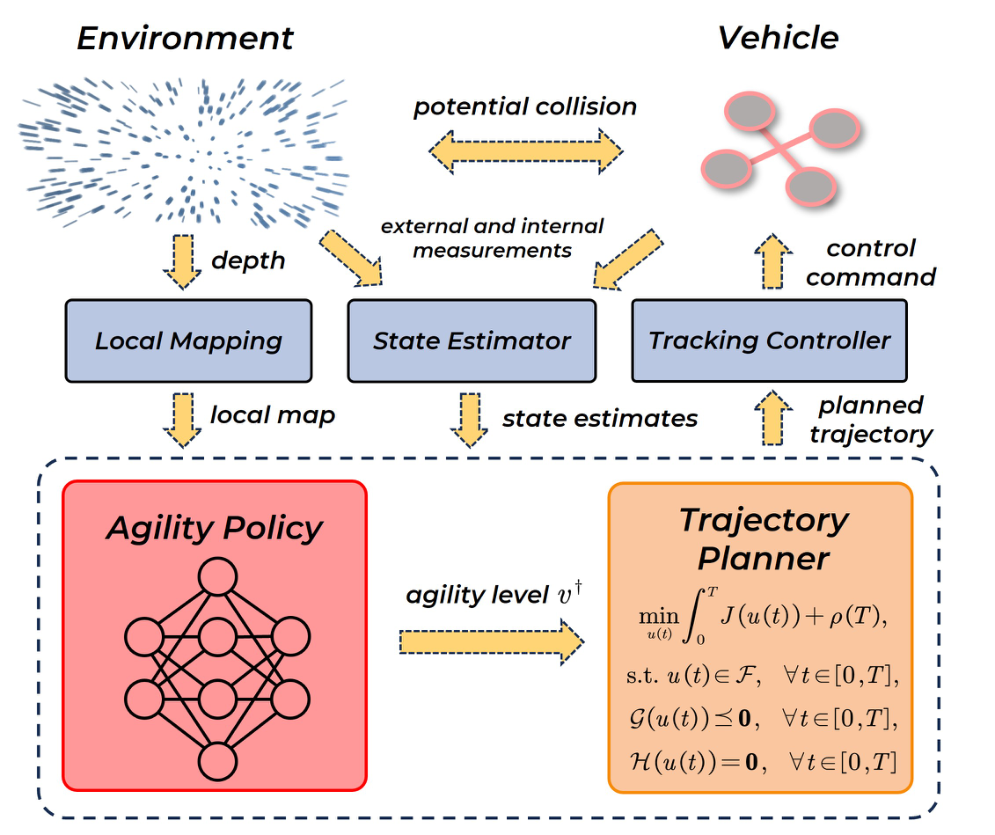

# R12-F2 — 原图外观锚点

**Learning Speed Adaptation for Flight in Clutter**

- 原 PDF：[2403.04586v2.pdf](../../../papers/preferred_29/2403.04586v2.pdf#page=3)；Fig. 2；PDF 第 3 页（1-based）。
- SHA256：`65545c4541f103f2747149318b2f1519e75bfb2b109e175b86cd0be708beaeaa`。
- 本图：**SOURCE_FAITHFUL_CROP**，直接裁自原 PDF，不是重绘、AI 生成图或旧布局草图。
- 裁框（PDF pt，左上原点）：`[315.746, 56.07169, 554.24615, 256.28101]`；宽高比 `1.19125`；300 dpi；995×835 px。
- 测量依据：Embedded source raster placement is exact. Internal card/envelope bounds visually measured from the actual raster at PDF scale, tolerance about 1.5 pt. No vector fonts or source RGB are inferred from this raster.

## 选择与外观特征

家族：`compact-hierarchical-policy-planner`。

- Compact single-column framework, ratio around 1.19 rather than a broad panoramic pipeline
- Upper environment/vehicle mechanism row, middle sensing/control row, lower dashed hierarchical-policy region
- Two lower cards: red learned policy and orange mathematical planner
- Gold polygon arrows are the functional connectors
- Explicit high-level agility action separates learned control authority from low-level tracking

## 分区与几何

坐标为相对当前裁图的归一化 `[x0,y0,x1,y1]`。它描述外观，不强制新方法具有源论文的模块。

| 区域 | 父区域 | 归一化边界 | 原图形状 |
|---|---|---|---|
| environment (upper scene mechanism) | — | `[0.02077, 0.02462, 0.34991, 0.26436]` | black italic title above blue spatial-flow/scene miniature |
| vehicle (upper system mechanism) | — | `[0.70966, 0.02462, 0.88995, 0.25937]` | black italic title above a small red/gray quadrotor glyph |
| sensing_and_control (middle system envelope) | — | `[0.06396, 0.35427, 0.91259, 0.45816]` | three aligned blue-gray rectangles: local mapping, state estimator, tracking controller |
| hierarchical_policy (lower learning-and-planning group) | — | `[0.03712, 0.55206, 0.95075, 0.98361]` | thin navy dashed rounded enclosure |
| agility_policy (learned high-level branch) | hierarchical_policy | `[0.06144, 0.57654, 0.3671, 0.95215]` | red/pink rounded card containing a drawn neural-network graph |
| agility_interface (explicit high-level action) | hierarchical_policy | `[0.40106, 0.69891, 0.58597, 0.78632]` | gold right arrow, labelled agility level with mathematical variable |
| trajectory_planner (model-based branch) | hierarchical_policy | `[0.61029, 0.57904, 0.91763, 0.95514]` | orange rounded card containing an optimization objective and constraints |

## 配色、字体与线条

颜色样本是该 PDF 以所列分辨率渲染后的 RGB 近似；包含色彩管理、透明叠色和抗锯齿影响。vector_rgb/opacity 是 PDF 图形中的数值，不能把原始 fill 直接当最终显示色。

| 部位 | 渲染样本 | 源 fill / opacity（若可取得） | 证据 |
|---|---|---|---|
| mapping/estimation/control blue-gray | `#B9C7E2` | raster / 不可反推源颜色 | median rendered pixel sample; whole source framework is raster |
| agility-policy red/pink | `#FF9899` | raster / 不可反推源颜色 | median rendered pixel sample; whole source framework is raster |
| trajectory-planner orange | `#FAC69F` | raster / 不可反推源颜色 | median rendered pixel sample; whole source framework is raster |
| interface-arrow gold | `#FFD475` | raster / 不可反推源颜色 | median rendered pixel sample; whole source framework is raster |

字体证据：visual observation; all figure text is embedded in source raster, PDF caption fonts excluded。Bold italic sans-serif titles for Environment, Vehicle, Agility Policy and Trajectory Planner; smaller italic sans-serif system/interface labels; serif mathematical objective, constraints and variables. Exact font family and source point sizes cannot be recovered from this PDF.

Keep the sans-serif italic engineering labels paired with serif math, the compact hierarchy, and an explicit action label between the two lower cards. Do not substitute a universal regular Times flowchart.

## 连线与机制小图

Gold filled arrow polygons with thin dark/dashed edges. Environment and vehicle use a double-headed potential-collision arrow. Depth/measurements flow down to sensing; local-map/state-estimate arrows point down into the lower hierarchical policy; the planner returns a trajectory up to tracking control and control commands up to the vehicle.

Upper sensing/control row shares one baseline. The lower red learned policy and orange model-based planner are separated by a conspicuous horizontal agility-level arrow. Short vertical/diagonal arrows preserve the complete system loop.

Potential collision, depth, external and internal measurements, local map, state estimates, planned trajectory, control command, agility level. Source action is a high-level speed/agility bound, not direct motor thrust or attitude.

源图小图：Blue environment/flow miniature, quadrotor glyph, explicit neural-network graph inside the red card, actual optimization objective and constraints inside the orange card.

Use a true learned-policy graph and the actual planner objective/constraint structure when the new method is hierarchical. The equation miniature is part of the visual identity and cannot be replaced by an empty Planner box.

## 可迁移边界与失败模式

Transfer the compact three-level composition, colors, arrow polygons, learned-network glyph and optimizer-equation miniature. Preserve the new project's actual learned action and model-based planner; speed/agility constraints belong to this source method and are not mandatory for every RL paper. Source equations must be replaced with validated project equations.

避免：Using the full-width R20/R25 training pipeline solely because the method uses RL misses this Letter's visual structure. Replacing the optimization equations and neural graph with two empty rounded boxes would lose its distinctive mechanism content.

## 使用时的视觉核验

同时打开本原图裁图和新稿渲染。先对照整体比例/分区占比，再对照嵌套层级、模块形状、颜色透明度、字体层级、机制小图和箭头语法。旧 sketches/*.svg 仅是结构分析草图，不参与原图外观验收。

新稿需保留可编辑文字与矢量模块；源图裁图是参考材料，不能作为冒充原创方法图或实验结果的输出。
