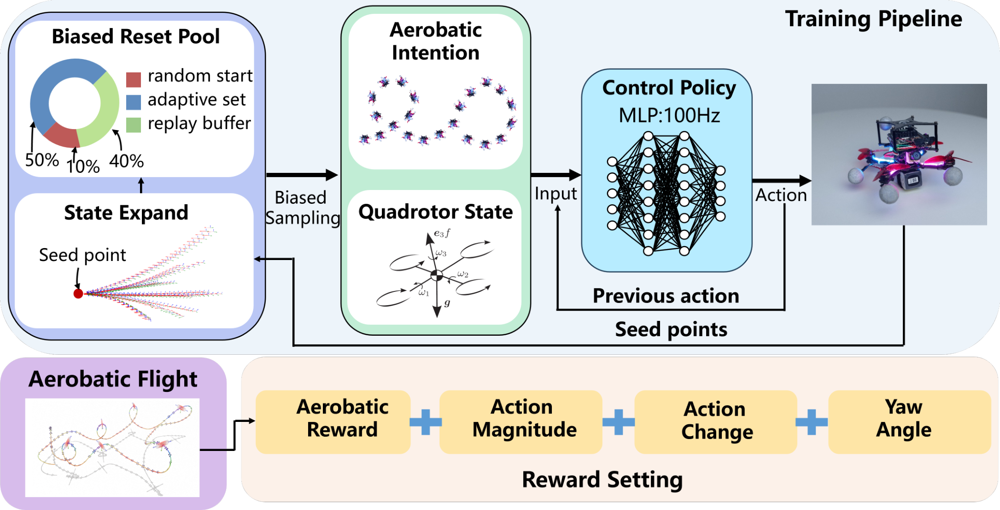

# R20-F2 — 原图外观锚点

**Reactive Aerobatic Flight via Reinforcement Learning**

- 原 PDF：[2505.24396v1.pdf](../../../papers/preferred_29/2505.24396v1.pdf#page=4)；Fig. 2；PDF 第 4 页（1-based）。
- SHA256：`ff6d412e73acc385875c9e5208b1dbe5b4be7637552d34c095eb94c11a50fbe0`。
- 本图：**SOURCE_FAITHFUL_CROP**，直接裁自原 PDF，不是重绘、AI 生成图或旧布局草图。
- 裁框（PDF pt，左上原点）：`[54, 54, 558, 310.81]`；宽高比 `1.96254`；300 dpi；2100×1071 px。
- 测量依据：Embedded source raster placement is exact; internal zones are visually measured at source size, tolerance about 2 pt. Source crop is unchanged raster content rendered through the PDF.

## 选择与外观特征

家族：`training-loop-with-mechanism-and-reward-strip`。

- Upper training zone around 69% of crop height, lower task/reward strip around 30%
- Two vertically stacked miniatures inside each tall observation group
- One broad left-to-right policy loop with visible feedback
- Four yellow reward cells separated by blue plus signs

## 分区与几何

坐标为相对当前裁图的归一化 `[x0,y0,x1,y1]`。它描述外观，不强制新方法具有源论文的模块。

| 区域 | 父区域 | 归一化边界 | 原图形状 |
|---|---|---|---|
| training (main outer zone) | — | `[0.0, 0.0, 1.0, 0.69312]` | very pale blue rounded background |
| reset_and_expand (two scientific mechanisms) | training | `[0.00794, 0.02336, 0.26587, 0.66586]` | lavender rounded enclosure containing two white cards |
| intention_and_state (policy observations) | training | `[0.33929, 0.01168, 0.53175, 0.65807]` | mint rounded enclosure containing two white cards |
| policy (network) | training | `[0.58135, 0.13629, 0.75198, 0.52957]` | cyan rounded card with an explicit neural-network diagram |
| platform (environment/dynamics) | training | `[0.81151, 0.16355, 0.9881, 0.44391]` | source platform render/photo rectangle |
| flight (task illustration) | — | `[0.0, 0.70091, 0.23016, 1.0]` | lavender rounded card with 3D trajectory miniature |
| reward_strip (reward decomposition) | — | `[0.24206, 0.70091, 1.0, 0.98906]` | pale peach rounded strip with four yellow rounded reward cells and blue plus symbols |

## 配色、字体与线条

颜色样本是该 PDF 以所列分辨率渲染后的 RGB 近似；包含色彩管理、透明叠色和抗锯齿影响。vector_rgb/opacity 是 PDF 图形中的数值，不能把原始 fill 直接当最终显示色。

| 部位 | 渲染样本 | 源 fill / opacity（若可取得） | 证据 |
|---|---|---|---|
| training background | `#EDF4FA` | raster / 不可反推源颜色 | median rendered pixel sample; source raster |
| reset lavender | `#BAC7F5` | raster / 不可反推源颜色 | median rendered pixel sample; source raster |
| intention mint | `#C1EDD5` | raster / 不可反推源颜色 | median rendered pixel sample; source raster |
| policy cyan | `#B7ECFF` | raster / 不可反推源颜色 | median rendered pixel sample; source raster |
| task lavender | `#D7BCEB` | raster / 不可反推源颜色 | median rendered pixel sample; source raster |
| reward pale peach | `#FCF1E9` | raster / 不可反推源颜色 | median rendered pixel sample; source raster |
| reward yellow | `#FEE5A6` | raster / 不可反推源颜色 | median rendered pixel sample; source raster |

字体证据：visual observation; entire source framework is an embedded raster。Bold sans-serif card headings, regular sans-serif interface labels. Compact two-line headings; training title aligned at upper right; reward title centered at bottom. Exact font family and point sizes cannot be recovered from this PDF.

Keep source sans-serif weight hierarchy, illustrated cards, and short data-flow labels rather than a generic serif box template.

## 连线与机制小图

Thicker black forward horizontal arrows across the top flow; thin orthogonal feedback loops run below the policy/platform; separate previous-action and seed-point return paths.

Forward chain is visually dominant. Reward area uses big blue plus signs, not a row of flow arrows.

Biased Sampling, Input, Action, Previous action, Seed points; 100 Hz on the policy is a source-specific interface value.

源图小图：Reset mixture donut and legend, state-expansion ray/scatter miniature, aerobatic intent montage, quadrotor coordinates, explicit MLP glyph, platform image, task trajectory.

A new sampling mechanism needs its own diagram with real variable semantics. Source donut percentages and 100 Hz must not be reused as project values.

## 可迁移边界与失败模式

Transfer composition, enclosed scientific miniatures, loop hierarchy and reward strip. Use actual reset rules, observation fields, network and reward decomposition from the new project.

避免：Collapsing the reset mechanism to one labelled empty box discards the feature that makes this framework recognizably similar to the reference.

## 使用时的视觉核验

同时打开本原图裁图和新稿渲染。先对照整体比例/分区占比，再对照嵌套层级、模块形状、颜色透明度、字体层级、机制小图和箭头语法。旧 sketches/*.svg 仅是结构分析草图，不参与原图外观验收。

新稿需保留可编辑文字与矢量模块；源图裁图是参考材料，不能作为冒充原创方法图或实验结果的输出。
