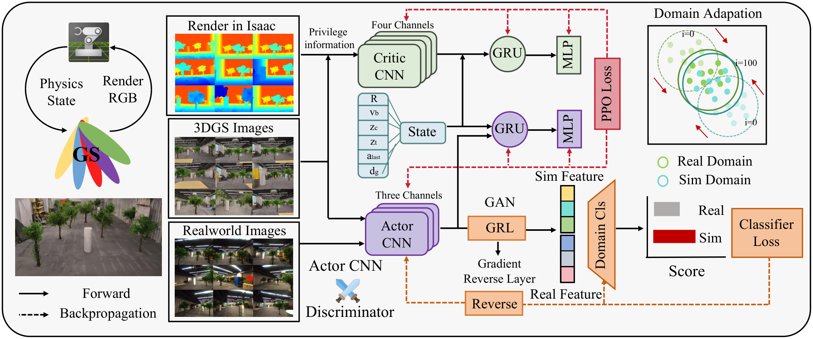

# R23-F3 — 原图外观锚点

**Flying in Clutter on Monocular RGB by Learning in 3D Radiance Fields with Domain Adaptation**

- 原 PDF：[2512.17349v1.pdf](../../../papers/preferred_29/2512.17349v1.pdf#page=4)；Fig. 3；PDF 第 4 页（1-based）。
- SHA256：`4c4a38bc2f963987f8d120483b0c988cbcaa49f0f992af81dbae33e257debdcc`。
- 本图：**SOURCE_FAITHFUL_CROP**，直接裁自原 PDF，不是重绘、AI 生成图或旧布局草图。
- 裁框（PDF pt，左上原点）：`[54.3, 54.3, 556.7, 264]`；宽高比 `2.3958`；300 dpi；2094×874 px。
- 测量依据：Outer container, CNN stack shapes and image grids measured from source PDF paths and image placements. Semantic envelopes around ungrouped stages are approximate and are marked as envelopes.

## 选择与外观特征

家族：`network-data-domains-and-gradient-paths`。

- Overall ratio around 2.40
- Three vertically aligned source-image grids at left-center
- Specific stack/circle/bar glyphs distinguish CNN/GRU/MLP
- A regular serif scientific diagram rather than uniformly rounded cards
- Multiple gradient colors and forward/backward legend

## 分区与几何

坐标为相对当前裁图的归一化 `[x0,y0,x1,y1]`。它描述外观，不强制新方法具有源论文的模块。

| 区域 | 父区域 | 归一化边界 | 原图形状 |
|---|---|---|---|
| outer (whole training figure) | — | `[0.00205, 0.00467, 0.99789, 0.99437]` | thin black rounded perimeter over nearly white gray fill |
| physics_and_render (data source envelope) | outer | `[0.01855, 0.06705, 0.19863, 0.81412]` | physics/render circular arrows; 3DGS mark; real-scene thumbnail |
| image_domains (three explicit data grids) | outer | `[0.2042, 0.04497, 0.36881, 0.95036]` | three 3x3 image collages with titles and black thin borders |
| critic (privileged branch envelope) | outer | `[0.43989, 0.09132, 0.71397, 0.26085]` | four offset pale-green CNN plates, green circular GRU, vertical MLP bar |
| state_fusion (state branch envelope) | outer | `[0.44526, 0.27039, 0.71397, 0.5279]` | blue state vector/fusion box, purple circular GRU, vertical MLP bar |
| actor_encoder (RGB branch) | outer | `[0.44893, 0.59886, 0.54041, 0.7546]` | three offset purple CNN plates |
| adaptation (domain-loss mechanism envelope) | outer | `[0.57178, 0.57082, 0.75577, 0.93152]` | orange GRL/Reverse blocks, stacked features, orange domain-classifier wedge |
| latent_plot (mechanism illustration) | outer | `[0.79642, 0.07387, 0.94359, 0.42704]` | small square with two domains, circular distribution envelopes and red motion arrows |
| score_loss (loss envelope) | outer | `[0.79558, 0.58035, 0.98806, 0.82833]` | tiny score bars and orange classifier-loss card |

## 配色、字体与线条

颜色样本是该 PDF 以所列分辨率渲染后的 RGB 近似；包含色彩管理、透明叠色和抗锯齿影响。vector_rgb/opacity 是 PDF 图形中的数值，不能把原始 fill 直接当最终显示色。

| 部位 | 渲染样本 | 源 fill / opacity（若可取得） | 证据 |
|---|---|---|---|
| outer gray appearance | `#F7F7F7` | `#D9D9D9` / 0.2 | source vector fill and opacity; sample records rendered appearance |
| critic green | `#DFEBD9` | `#E0EBD9` / 1 | source vector fill plus rendered sample |
| actor purple | `#C8C0E0` | `#C9C0E1` / 1 | source vector fill plus rendered sample |
| gradient reversal orange | `#F7C49D` | `#F7C49D` / 1 | source vector fill plus rendered sample |
| classifier-loss orange | `#F5C29C` | `#F5B482` / 0.78 | source vector fill and opacity; sample records rendered appearance |

字体证据：source PDF figure text spans extracted。Predominantly TimesNewRomanPSMT, common main labels 8.75 pt; auxiliary labels 6.58 pt; tiny state symbols 4.41 pt. Some 9.87 pt labels and a 13.16 pt bold source mark. These are source-sized measurements, not a recommendation to make new diagrams illegibly small.

Preserve regular serif module labels and compact scientific math. If new text cannot fit legibly at publication width, simplify or expand the figure instead of shrinking all labels.

## 连线与机制小图

Black solid forward arrows; red dashed PPO backward routes at top and center; orange dashed adversarial reverse route along the bottom. Circular arrows only describe physics-to-render generation.

Forward edges and backward paths use separate spatial channels. A small lower-left legend explicitly explains solid/dashed arrows.

Privilege information, State, Sim Feature, Real Feature, GRL, PPO Loss. Use the actual training-only inputs and update directions of the new method.

源图小图：Depth/RGB/real RGB grids; stacked CNN plates; GRU circles; vertical MLP bars; colored feature stack; distribution-shift miniature; score-bar miniature.

These are concrete mechanism drawings, not decorative icons. Transfer their grammar only for genuine encoders, recurrent modules, feature alignment and loss branches.

## 可迁移边界与失败模式

Transfer network glyphs, image-domain lanes and separate gradient routing. Copying privileged depth or domain adaptation into a method without those components would change its scientific claim.

避免：The existing SVG replaces the full diagram with five empty rectangles, loses image-grid composition and makes PPO a separate giant card. It is not an appearance template.

## 使用时的视觉核验

同时打开本原图裁图和新稿渲染。先对照整体比例/分区占比，再对照嵌套层级、模块形状、颜色透明度、字体层级、机制小图和箭头语法。旧 sketches/*.svg 仅是结构分析草图，不参与原图外观验收。

新稿需保留可编辑文字与矢量模块；源图裁图是参考材料，不能作为冒充原创方法图或实验结果的输出。
