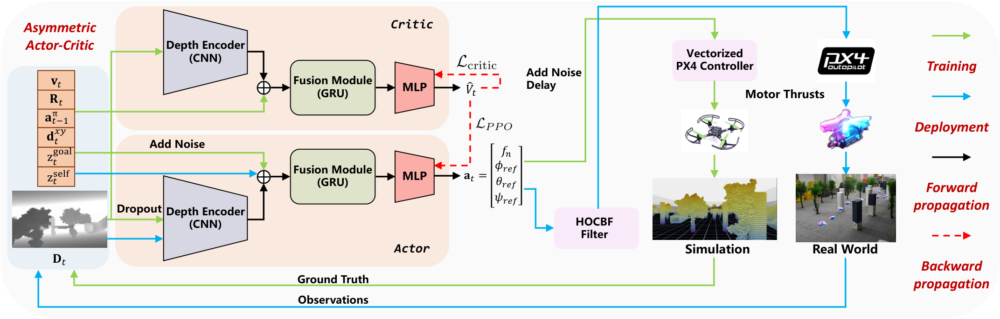

# R25-F1 — 原图外观锚点

**High-Speed Vision-Based Flight in Clutter with Safety-Shielded Reinforcement Learning**

- 原 PDF：[2602.08653v2.pdf](../../../papers/preferred_29/2602.08653v2.pdf#page=3)；Fig. 1；PDF 第 3 页（1-based）。
- SHA256：`eb95baaebb709d3fb89afdbf60ba907cd3db380ee0819ab9a03b7261132cd53a`。
- 本图：**SOURCE_FAITHFUL_CROP**，直接裁自原 PDF，不是重绘、AI 生成图或旧布局草图。
- 裁框（PDF pt，左上原点）：`[48.8, 55.9, 563.2, 220.2]`；宽高比 `3.13086`；300 dpi；2144×686 px。
- 测量依据：Whole and network backgrounds, encoder/GRU shapes and controller card bounds extracted from source vector paths; training/deployment lane envelopes measured from source image placements and arrows.

## 选择与外观特征

家族：`asymmetric-network-training-deployment-control`。

- Very wide ratio around 3.13
- Aligned upper critic/lower actor backgrounds occupy left-center
- CNN/GRU/MLP use different shapes
- Training and deployment line colors are functional
- Four-line arrow legend on right
- Very faint transparent backgrounds, not saturated pastel panels

## 分区与几何

坐标为相对当前裁图的归一化 `[x0,y0,x1,y1]`。它描述外观，不强制新方法具有源论文的模块。

| 区域 | 父区域 | 归一化边界 | 原图形状 |
|---|---|---|---|
| whole (figure background) | — | `[0.0006, 0.00164, 0.99957, 0.99738]` | almost-white gray rounded background; no thick outer border |
| observations (input vector and depth) | whole | `[0.00712, 0.20603, 0.10912, 0.8451]` | pale blue rounded area with orange state-vector table and grayscale depth thumbnail |
| critic (upper branch) | whole | `[0.11534, 0.01887, 0.44913, 0.40828]` | pale peach rounded background |
| actor (lower branch) | whole | `[0.11524, 0.42179, 0.44913, 0.83628]` | matching pale peach rounded background |
| encoder_critic (CNN) | critic | `[0.16343, 0.0294, 0.24728, 0.29598]` | blue-gray trapezoid |
| encoder_actor (CNN) | actor | `[0.16343, 0.551, 0.24728, 0.81789]` | matching blue-gray trapezoid |
| gru_critic (fusion) | critic | `[0.29042, 0.18831, 0.37516, 0.36007]` | pale-green rounded rectangle |
| gru_actor (fusion) | actor | `[0.29042, 0.46744, 0.37516, 0.63956]` | matching pale-green rounded rectangle |
| training_lane (simulation control envelope) | whole | `[0.67107, 0.12234, 0.77681, 0.8053]` | controller card, quadrotor miniature, simulation thumbnail |
| deployment_lane (real control envelope) | whole | `[0.79586, 0.12191, 0.89605, 0.8053]` | PX4 source logo, quadrotor miniature, real-world thumbnail |
| safety_filter (deployment-only mechanism) | whole | `[0.55424, 0.651, 0.6389, 0.78101]` | small pale-magenta rounded card |
| legend (flow-key envelope) | whole | `[0.91378, 0.11016, 0.98977, 0.91686]` | four vertical arrow samples with red italic labels |

## 配色、字体与线条

颜色样本是该 PDF 以所列分辨率渲染后的 RGB 近似；包含色彩管理、透明叠色和抗锯齿影响。vector_rgb/opacity 是 PDF 图形中的数值，不能把原始 fill 直接当最终显示色。

| 部位 | 渲染样本 | 源 fill / opacity（若可取得） | 证据 |
|---|---|---|---|
| whole gray appearance | `#FAFAFA` | `#EDEDED` / 0.251 | source vector opacity; rendered sample |
| branch pale peach appearance | `#F9E9DF` | `#F8CBAD` / 0.349 | source vector opacity over gray background; rendered sample |
| CNN pale blue appearance | `#D6D7E3` | `#B4C7E7` / 0.502 | source vector opacity; rendered sample |
| GRU pale green appearance | `#DEE3C9` | `#C5E0B4` / 0.502 | source vector opacity; rendered sample |
| controller/filter pale magenta appearance | `#F9EAFA` | `#FABBFC` / 0.251 | source vector opacity; rendered sample |
| training green line | `#92D050` | `#92D050` / 1 | vector line color; probe may fall in white, use vector color for arrows |
| deployment blue line | `#00AFEF` | `#00B0F0` / 1 | source vector line color and rendered legend-line sample |

字体证据：source PDF figure spans and font resources extracted。English network labels are mostly MicrosoftYaHei-Bold around 5.42 pt; CambriaMath around 4.49-6.60 pt for symbols; Calibri-BoldItalic 7.58 pt for the legend; Consolas-BoldItalic 6.60 pt for Actor/Critic. Caption serif text lies outside crop.

This anchor does not use universal Times labels. Match compact bold sans-serif module labels, italic branch labels and scientific math. Source 5.42 pt is a tiny figure label and should not be reproduced blindly if the new figure has longer names.

源图线条参数：`{"module_width_pt": 0.472699, "gradient_style": "red dashed", "forward_style": "black solid", "training_style": "green solid", "deployment_style": "cyan solid"}`。

## 连线与机制小图

Black forward network arrows; red dashed backpropagation next to actor/critic outputs; green training and blue deployment paths run around top and bottom of the figure.

Network branches share x positions. Simulation and real-world control paths occupy adjacent right-side vertical lanes; HOCBF is visibly on the deployment branch.

Ground Truth, Observations, Motor Thrusts; action shown as thrust and attitude references. The source does not expand the action-to-acceleration filter conversion.

源图小图：State-vector table, grayscale depth input, CNN trapezoids, GRU rounded boxes, MLP wedges, two quadrotor images, simulation and real thumbnails, PX4 logo.

Use authentic project sensor/platform imagery and actual controller identity. Preserve glyph variety and aligned two-row architecture; do not fabricate real experiment imagery.

## 可迁移边界与失败模式

Transfer visual architecture and train/deploy lane grammar. The new method must specify its actual action units, controller and filter location; source interface omissions are not a reason to omit a needed conversion.

避免：A three-card flowchart loses the dual network branches, module glyphs, faint fills and colored control paths. Copying only raw fill RGB without source opacity makes backgrounds much too dark.

## 使用时的视觉核验

同时打开本原图裁图和新稿渲染。先对照整体比例/分区占比，再对照嵌套层级、模块形状、颜色透明度、字体层级、机制小图和箭头语法。旧 sketches/*.svg 仅是结构分析草图，不参与原图外观验收。

新稿需保留可编辑文字与矢量模块；源图裁图是参考材料，不能作为冒充原创方法图或实验结果的输出。
