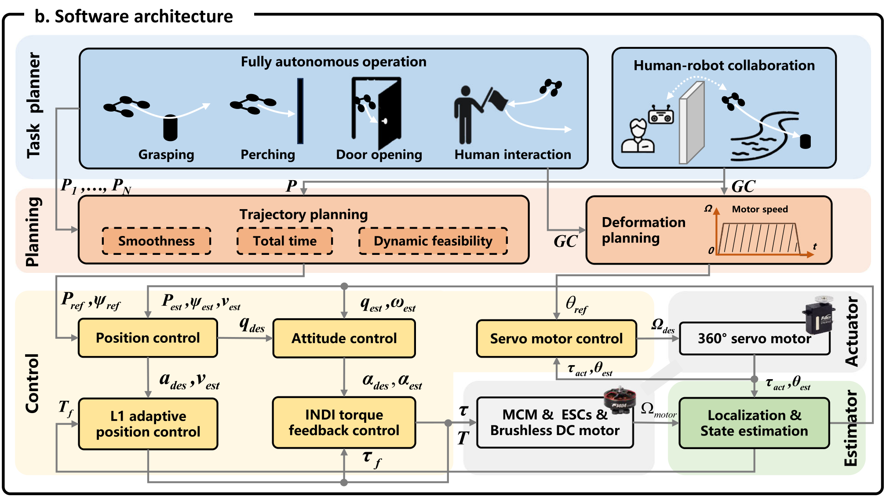

# R29-F2-software — 原图外观锚点

**Hand-like autonomous flying robot for airborne grasping and interaction**

- 原 PDF：[s41467-026-68967-3.pdf](../../../papers/preferred_29/s41467-026-68967-3.pdf#page=4)；Fig. 2；PDF 第 4 页（1-based）。
- SHA256：`114055a773ccadd35cb08d724cf7652830a6a4591b86146a0a26b4f12b6d9782`。
- 本图：**SOURCE_FAITHFUL_CROP**，直接裁自原 PDF，不是重绘、AI 生成图或旧布局草图。
- 裁框（PDF pt，左上原点）：`[59, 225, 542.2, 496.2]`；宽高比 `1.78171`；300 dpi；2015×1131 px。
- 测量依据：Faithful subcrop of actual panel b; borders and principal modules measured from source PDF paths.

## 选择与外观特征

家族：`horizontal-functional-bands-software`。

- Landscape ratio about 1.78
- Blue task band around 29% height, orange planning around 17%, lower control/actuation/estimation around 37%
- Sideways functional-band labels
- Unequal functional region sizes reflect control graph
- Concrete task and actuator miniatures

## 分区与几何

坐标为相对当前裁图的归一化 `[x0,y0,x1,y1]`。它描述外观，不强制新方法具有源论文的模块。

| 区域 | 父区域 | 归一化边界 | 原图形状 |
|---|---|---|---|
| outer (software frame) | — | `[0.00327, 0.02821, 0.9964, 0.99399]` | black rounded frame with interrupted title edge |
| task (first band) | outer | `[0.01709, 0.07006, 0.98315, 0.36136]` | blue task band with two outlined task groups |
| planning (second band) | outer | `[0.01709, 0.37979, 0.98315, 0.54841]` | orange band split between trajectory/deformation branches |
| control (lower left) | outer | `[0.01656, 0.58492, 0.7386, 0.95645]` | cream area, yellow control modules |
| actuator (lower right upper) | outer | `[0.75538, 0.58628, 0.98303, 0.74853]` | gray actuator band, real actuator thumbnail |
| estimation (lower right lower) | outer | `[0.75412, 0.76663, 0.9775, 0.95645]` | green estimation area |

## 配色、字体与线条

颜色样本是该 PDF 以所列分辨率渲染后的 RGB 近似；包含色彩管理、透明叠色和抗锯齿影响。vector_rgb/opacity 是 PDF 图形中的数值，不能把原始 fill 直接当最终显示色。

| 部位 | 渲染样本 | 源 fill / opacity（若可取得） | 证据 |
|---|---|---|---|
| task background | `#E7F0F9` | raster / 不可反推源颜色 | rendered sample from source raster/vector composite |
| planning background | `#FCEBE1` | raster / 不可反推源颜色 | rendered sample from source raster/vector composite |
| control background | `#FFF8E5` | `#FFF8E5` / 1 | source vector fill plus rendered sample |
| control module | `#FFE599` | `#FFE699` / 1 | source vector fill plus rendered sample |
| estimator module | `#C5DFB3` | `#C5E0B4` / 1 | source vector fill plus rendered sample |

字体证据：visual observation; main figure labels outlined/raster。Bold sans-serif functional labels; vertical band labels at left; black italic serif symbols adjacent to arrows; white title knockout.

Keep label families tied to this anchor. The source math is not the variable specification of a new method.

源图线条参数：`{"outer_width_pt": 1.525, "module_width_pt": 1.017}`。

## 连线与机制小图

Gray orthogonal connections with arrowhead direction and italic variable names; control feedback paths run in reserved gaps.

Two planning branches feed different controllers/actuators. Avoid a single linear chain if the actual method is a closed-loop graph.

Interface variables must be replaced with actual manuscript notation.

源图小图：Task silhouettes, deformation/motor-speed miniature, servo and motor thumbnails.

Match small diagrams to supported tasks and actual mechanisms; use available real platform assets only.

## 可迁移边界与失败模式

Style transfer only; the source multi-DoF robot and adaptive/INDI control are not required for a different manuscript. Use the parent anchor for original full-figure context.

避免：An empty planner-controller-estimator box row omits task miniatures, two-level control, actuator split and annotated feedback, which are major components of this look.

## 使用时的视觉核验

同时打开本原图裁图和新稿渲染。先对照整体比例/分区占比，再对照嵌套层级、模块形状、颜色透明度、字体层级、机制小图和箭头语法。旧 sketches/*.svg 仅是结构分析草图，不参与原图外观验收。

新稿需保留可编辑文字与矢量模块；源图裁图是参考材料，不能作为冒充原创方法图或实验结果的输出。
