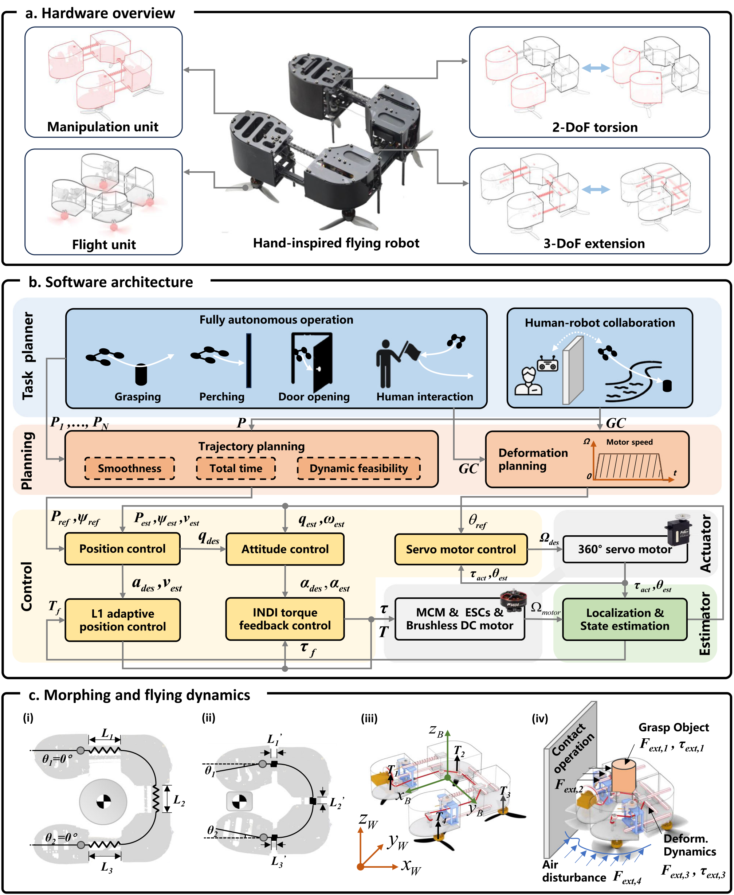

# R29-F2 — 原图外观锚点

**Hand-like autonomous flying robot for airborne grasping and interaction**

- 原 PDF：[s41467-026-68967-3.pdf](../../../papers/preferred_29/s41467-026-68967-3.pdf#page=4)；Fig. 2；PDF 第 4 页（1-based）。
- SHA256：`114055a773ccadd35cb08d724cf7652830a6a4591b86146a0a26b4f12b6d9782`。
- 本图：**SOURCE_FAITHFUL_CROP**，直接裁自原 PDF，不是重绘、AI 生成图或旧布局草图。
- 裁框（PDF pt，左上原点）：`[59, 48, 542.2, 637.4]`；宽高比 `0.81982`；300 dpi；2015×2456 px。
- 测量依据：All three outer frame bounds and software module geometry extracted from PDF paths. Hardware and some software illustrations are raster. The crop includes panel titles above interrupted frame edges.

## 选择与外观特征

家族：`hardware-software-dynamics-multipanel`。

- Portrait multipanel, ratio about 0.82
- Hardware/software/dynamics height split around 28/44/22% plus title/gap space
- White knockout panel titles interrupt frame borders
- Software uses horizontal pastel bands and genuine task/mechanism illustrations
- Geometry and forces occupy a separate evidence-rich lower panel

## 分区与几何

坐标为相对当前裁图的归一化 `[x0,y0,x1,y1]`。它描述外观，不强制新方法具有源论文的模块。

| 区域 | 父区域 | 归一化边界 | 原图形状 |
|---|---|---|---|
| hardware (panel a) | — | `[0.00304, 0.01344, 0.99617, 0.29593]` | thin black rounded frame with title knockout at top |
| software (panel b) | — | `[0.00327, 0.31328, 0.9964, 0.75767]` | matching framed panel |
| dynamics (panel c) | — | `[0.00304, 0.77467, 0.99642, 0.99737]` | matching frame with four mechanism miniatures |
| task (software first band) | software | `[0.01709, 0.33254, 0.98315, 0.46658]` | pale blue horizontal band; two outlined task groups |
| planning (software second band) | software | `[0.01709, 0.47506, 0.98315, 0.55265]` | pale orange band; trajectory and deformation planning |
| control (software lower left) | software | `[0.01656, 0.56944, 0.7386, 0.7404]` | pale yellow background; two-level control module graph |
| estimation (software lower right) | software | `[0.75412, 0.65305, 0.9775, 0.7404]` | pale green lower-right area |

## 配色、字体与线条

颜色样本是该 PDF 以所列分辨率渲染后的 RGB 近似；包含色彩管理、透明叠色和抗锯齿影响。vector_rgb/opacity 是 PDF 图形中的数值，不能把原始 fill 直接当最终显示色。

| 部位 | 渲染样本 | 源 fill / opacity（若可取得） | 证据 |
|---|---|---|---|
| task pale blue | `#E7F0F9` | raster / 不可反推源颜色 | rendered sample; this upper panel includes source raster content |
| task group blue | `#BDD7EE` | raster / 不可反推源颜色 | rendered sample; source raster |
| planning pale orange | `#FCEBE1` | raster / 不可反推源颜色 | rendered sample; source raster |
| planning module orange | `#F8CBAC` | `#F8CBAD` / 1 | source vector fill; rendered sample |
| control background cream | `#FFF8E5` | `#FFF8E5` / 1 | source vector fill; rendered sample |
| control module yellow | `#FFE599` | `#FFE699` / 1 | source vector fill; rendered sample |
| estimation green | `#C5DFB3` | `#C5E0B4` / 1 | source vector fill; rendered sample |

字体证据：figure labels predominantly raster or outlined drawing; exact font family not recoverable from text spans。Bold sans-serif panel/module labels and task captions; italic serif mathematical interface symbols. Panel titles use a/b/c prefixes within a white knockout in the frame top edge. Serif article caption sits outside the crop.

Preserve sans-serif label/serif math pairing and frame title interruption; avoid claiming a precise source font family.

源图线条参数：`{"outer_width_pt": 1.525, "module_width_pt": 1.017, "hardware_subframe_width_pt": 0.678, "planning_constraint_dash_pt": [4.0668, 3.0501]}`。

## 连线与机制小图

Thin gray orthogonal arrows in software, annotated with italic mathematical variables; black module borders; paired light-blue bidirectional hardware arrows; dynamics arrows use coordinate colors.

Tasks feed planning; planning splits into trajectory and deformation paths. Position/attitude/servo control and actuator/estimator feedback paths remain distinct.

Source states/commands and control gains belong to the source system; transfer the symbol placement convention with the new project variables.

源图小图：Actual central robot image, mechanism line drawings, task silhouettes, deformation miniature, actuator images, morphing geometry and force/coordinate panels.

For a software-only paper, use the software sub-anchor. The full vertical multipanel needs real hardware/mechanism content and should not be filled with invented product imagery.

## 可迁移边界与失败模式

This is Nature Communications rather than an IEEE Letter/Transactions layout. Borrow the figure grammar where requested, then fit the appropriate IEEE full-width figure. It does not establish an IEEE manuscript page template.

避免：Compressing the entire portrait graphic into IEEE single-column width makes its text unreadable. Its software band is a better starting point for a control-only manuscript.

## 使用时的视觉核验

同时打开本原图裁图和新稿渲染。先对照整体比例/分区占比，再对照嵌套层级、模块形状、颜色透明度、字体层级、机制小图和箭头语法。旧 sketches/*.svg 仅是结构分析草图，不参与原图外观验收。

新稿需保留可编辑文字与矢量模块；源图裁图是参考材料，不能作为冒充原创方法图或实验结果的输出。
