# 机制小图原型：从真实原图学习如何表达中间量

本库的 13 个局部直接渲染自 7 篇论文、7 个主锚点。它补充整体布局锚点，重点研究卡片内的科学信息、接口和线型。它没有穷尽 29 篇论文或全部 281 个图例。

抽样记录：2026-10-02 的本次选择实际查看了 8 个原图锚点（完整清单见 manifest 的 selection_review）。此记录不代表未来新增条目已经查看。

**这些是原图局部学习材料，不是可以直接贴入新论文的素材，也不是新方法结果。** 外观相似来自正确的表达对象与关系，不能靠重复曲线、填满空卡片或添加不存在的算法。源图中的数字、公式、网络、地图、硬件、功能和实验快照均属于源论文。

先选整图主范本，再按当前研究的真实机制选择至多几个局部原型。每个局部须说明哪些输入资料已具备、哪些缺失；缺失的科学定义不要用源内容补齐。实验快照必须用作者的数据与平台输出，方案示意应明示其性质。

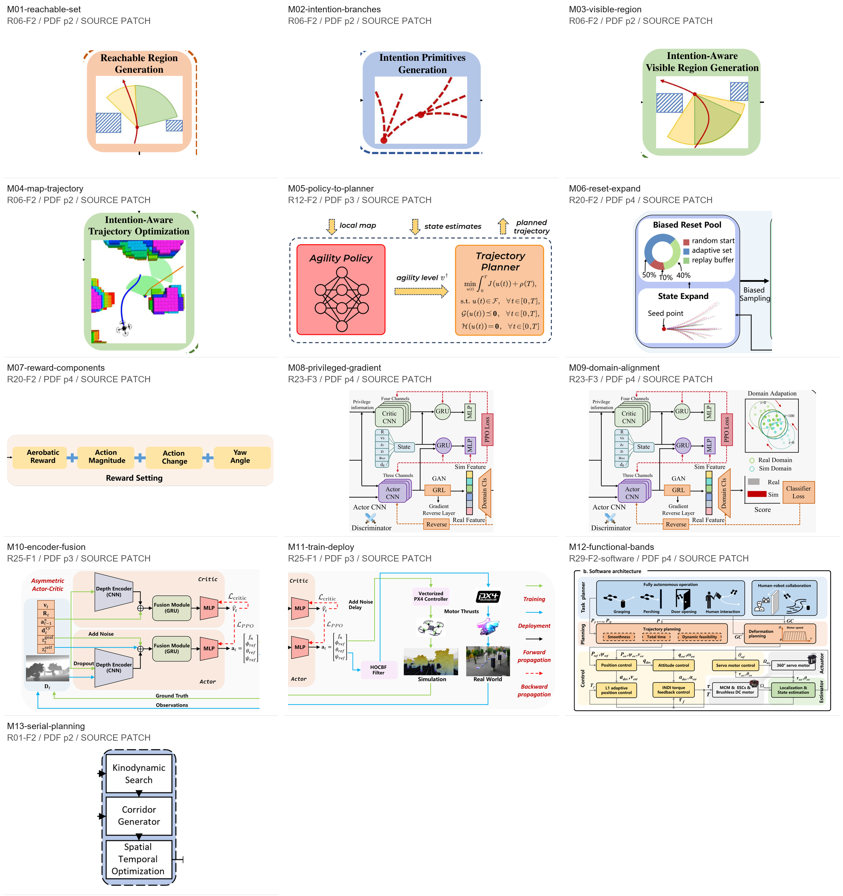

| 编号 | 要表达的作用 | 适用条件 | 来源 |
|---|---|---|---|
| [M01-reachable-set](#M01-reachable-set) | 可达域：把状态、障碍与候选方向画在同一局部几何中 | 新方法确实计算可达集合、运动方向集合或带约束的候选域。 | [R06-F2，PDF p2](../../../papers/preferred_29/2309.08854v4.pdf#page=2) |
| [M02-intention-branches](#M02-intention-branches) | 意图分叉：历史与多种未来假设的线型分工 | 新方法存在离散意图、多个运动原语、多假设预测或可解释的候选动作。 | [R06-F2，PDF p2](../../../papers/preferred_29/2309.08854v4.pdf#page=2) |
| [M03-visible-region](#M03-visible-region) | 可视区域：视域、遮挡与运动状态的组合表达 | 新方法实际处理视域、遮挡、目标可见性或传感方向约束。 | [R06-F2，PDF p2](../../../papers/preferred_29/2309.08854v4.pdf#page=2) |
| [M04-map-trajectory](#M04-map-trajectory) | 轨迹优化：地图、机器人、目标与可行关系一起出现 | 新方法能提供规划地图、参考/优化轨迹以及需要解释的空间约束。 | [R06-F2，PDF p2](../../../papers/preferred_29/2309.08854v4.pdf#page=2) |
| [M05-policy-to-planner](#M05-policy-to-planner) | 学习策略→高层参数→含公式规划器：接口本身就是创新位置 | 新方法由学习模块输出一个真实高层参数，由模型驱动规划器求解动作或轨迹。 | [R12-F2，PDF p3](../../../papers/preferred_29/2403.04586v2.pdf#page=3) |
| [M06-reset-expand](#M06-reset-expand) | 训练初态机制：分布组成与状态扩展成对说明 | 新方法的贡献涉及重置分布、课程采样、重放缓冲或初态扩展。 | [R20-F2，PDF p4](../../../papers/preferred_29/2505.24396v1.pdf#page=4) |
| [M07-reward-components](#M07-reward-components) | 奖励拆分：把训练目标分成可定位、可消融的项 | 新方法确实采用加和型奖励或损失，且各项值得单独解释或消融。 | [R20-F2，PDF p4](../../../papers/preferred_29/2505.24396v1.pdf#page=4) |
| [M08-privileged-gradient](#M08-privileged-gradient) | 特权分支与梯度：结构、前向和优化方向同时可读 | 新方法存在 actor/critic 特权输入差异，或前向数据流和梯度路径需要区分。 | [R23-F3，PDF p4](../../../papers/preferred_29/2512.17349v1.pdf#page=4) |
| [M09-domain-alignment](#M09-domain-alignment) | 域对齐：域分类路径与分布示意互相解释 | 新方法真实采用特征层域对齐或域分类目标，并有明确的训练路径。 | [R23-F3，PDF p4](../../../papers/preferred_29/2512.17349v1.pdf#page=4) |
| [M10-encoder-fusion](#M10-encoder-fusion) | 编码与融合：用形状差别表达不同模块职责 | 新方法有可确认的多模态编码、融合/记忆单元以及训练扰动。 | [R25-F1，PDF p3](../../../papers/preferred_29/2602.08653v2.pdf#page=3) |
| [M11-train-deploy](#M11-train-deploy) | 训练与部署：两条闭环及部署专用安全接口 | 新方法的仿真训练与实机部署管线存在需要说明的差异，尤其安全过滤器或控制接口的差异。 | [R25-F1，PDF p3](../../../papers/preferred_29/2602.08653v2.pdf#page=3) |
| [M12-functional-bands](#M12-functional-bands) | 任务—规划—控制：功能带、变量接口与真实任务示意 | 新方法涉及多个任务层、规划层与控制层，且系统结构值得展开。 | [R29-F2-software，PDF p4](../../../papers/preferred_29/s41467-026-68967-3.pdf#page=4) |
| [M13-serial-planning](#M13-serial-planning) | 串行规划层：紧凑地表示可解释的三阶段依赖 | 新方法的核心确实是按依赖关系串联的几步处理，且一列能够说明。 | [R01-F2，PDF p2](../../../papers/preferred_29/2011.03968v1.pdf#page=2) |

<a id="M01-reachable-set"></a>
## M01-reachable-set · 可达域：把状态、障碍与候选方向画在同一局部几何中

原图上部橙色卡片用红色运动曲线、绿色/黄色扇形与蓝色障碍解释 Reachable Region Generation。它给读者一个可视的中间表示，而不是只写模块名。

适用条件：新方法确实计算可达集合、运动方向集合或带约束的候选域。

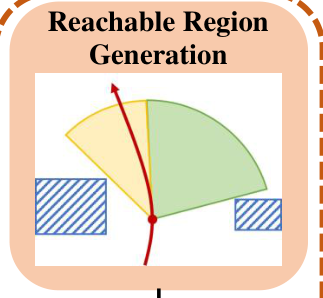

新方法必须提供：集合的定义及坐标系；当前位置/速度或朝向；域边界如何受动力学与障碍约束；各颜色代表的真实对象。

重画步骤：

1. 先列出需要读者分辨的几何对象与关系
2. 按新方法定义计算或明确标为示意的集合边界
3. 保持源图的留白、少量障碍、扇形层次与方向标记
4. 检查边界与障碍关系，不能为好看画出不可行区域

迁移边界：迁移扇形叠色、障碍纹理和方向箭头的表达方式；不继承源论文的可达域算法、扇形角度、颜色物理含义或轨迹。

来源：`R06-F2`，PDF p2；裁框（左上原点 PDF pt）`[261.8, 78, 338.9, 149.5]`。哈希、路径和渲染信息见 `manifest.json`。


<a id="M02-intention-branches"></a>
## M02-intention-branches · 意图分叉：历史与多种未来假设的线型分工

原图 Intention Primitives Generation 卡片在同一状态位置展开多条红色虚线候选分支，强调多模态未来，而不是重复画一条装饰曲线。

适用条件：新方法存在离散意图、多个运动原语、多假设预测或可解释的候选动作。

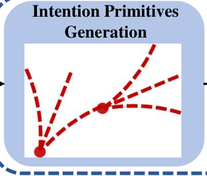

新方法必须提供：原语/意图的集合及数目依据；共享的起始状态；历史、候选和选中项的区分；分支是否含概率、速度或时域语义。

重画步骤：

1. 画明当前状态和共享的起点
2. 将真实候选的方向、曲率或速度差异变成可分辨分支
3. 固定历史与未来的线型规则
4. 不要画出算法不存在的分支来填卡片

迁移边界：可迁移共享起点、分叉、虚实线和标记大小；候选数量与形状必须来自新研究。单一确定预测不适用该多分支原型。

来源：`R06-F2`，PDF p2；裁框（左上原点 PDF pt）`[352, 78, 435, 148.7]`。哈希、路径和渲染信息见 `manifest.json`。


<a id="M03-visible-region"></a>
## M03-visible-region · 可视区域：视域、遮挡与运动状态的组合表达

原图 Intention-Aware Visible Region Generation 将相叠扇形、障碍和目标方向放在同一平面，让可见性约束具有可辨认的几何含义。

适用条件：新方法实际处理视域、遮挡、目标可见性或传感方向约束。

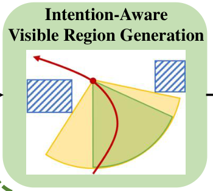

新方法必须提供：传感器视域的定义；被观察对象与观察者的关系；遮挡/障碍的作用；区域交叠的含义及其与目标函数或约束的关系。

重画步骤：

1. 确定需要画出的观察状态与目标状态
2. 按真实视域与遮挡关系建立区域
3. 沿用低饱和区域叠色和少量斜线障碍
4. 逐条核对轨迹与被禁止区域，不用相交线假装约束成立

迁移边界：只迁移几何表达语法；不能把源图的视域集合、意图条件或可见性计算当成新方法的定义。

来源：`R06-F2`，PDF p2；裁框（左上原点 PDF pt）`[352, 178, 435.7, 253]`。哈希、路径和渲染信息见 `manifest.json`。


<a id="M04-map-trajectory"></a>
## M04-map-trajectory · 轨迹优化：地图、机器人、目标与可行关系一起出现

原图优化卡片包含彩色体素地图、机器人、不同角色的曲线和半透明区域，信息密度来自可解释的真实中间量与空间关系。

适用条件：新方法能提供规划地图、参考/优化轨迹以及需要解释的空间约束。

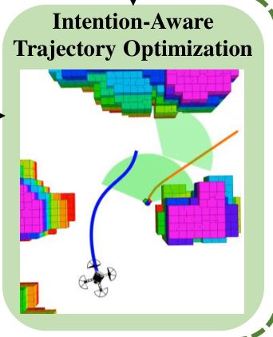

新方法必须提供：地图表示或真实地图截图；机器人/目标的角色；曲线各自代表什么；约束区域的定义；若是实测或仿真快照，其对应的运行与坐标系。

重画步骤：

1. 优先使用作者提供的地图或仿真渲染
2. 在同一坐标系叠加真实路径和约束量
3. 用少量颜色固定角色，不把彩色体素当装饰
4. 若仅有方案，改画明确标为 schematic 的简化几何并注明缺失证据

迁移边界：可迁移地图作为背景与路径/区域叠加的层次；源地图、实机图、优化轨迹和结果不能贴入新论文，也不能用生成图冒充实验输出。

来源：`R06-F2`，PDF p2；裁框（左上原点 PDF pt）`[446, 152.5, 528, 253.5]`。哈希、路径和渲染信息见 `manifest.json`。


<a id="M05-policy-to-planner"></a>
## M05-policy-to-planner · 学习策略→高层参数→含公式规划器：接口本身就是创新位置

原图以粉色学习策略、带参数名的金色箭头和橙色优化规划器说明两者关系；规划器内部保留目标与约束，并显示来自地图、状态的接口。

适用条件：新方法由学习模块输出一个真实高层参数，由模型驱动规划器求解动作或轨迹。

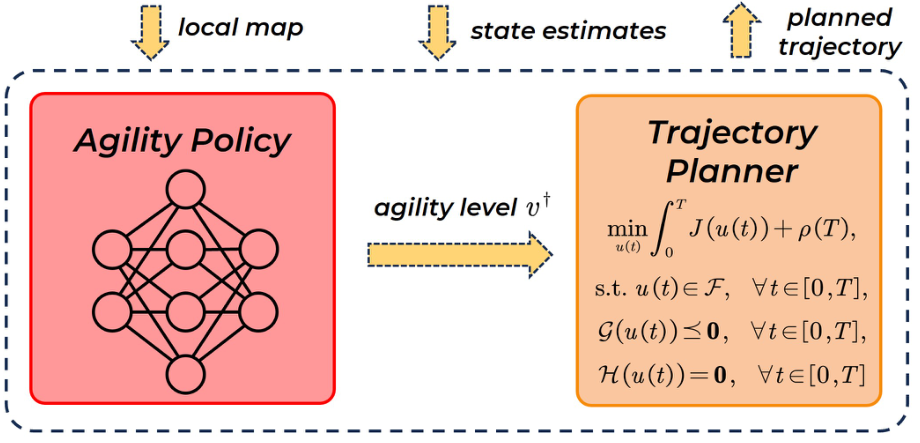

新方法必须提供：策略输入与输出参数；输出参数的单位、范围和作用位置；规划器目标与约束；输入地图/状态与输出轨迹的准确名称。

重画步骤：

1. 先画输入、策略输出与规划器变量的接口图
2. 将学习模块和模型模块放入两个相邻卡片
3. 在连接箭头上写真实参数，必要时另用机制图解释其作用
4. 仅放足以说明新机制的公式，不整段搬源公式

迁移边界：保留接口中心的构图与异质模块对比；agility level、原神经网络、优化目标和约束都属于源方法，新研究需分别替换。

来源：`R12-F2`，PDF p3；裁框（左上原点 PDF pt）`[323.5, 149, 544, 255]`。哈希、路径和渲染信息见 `manifest.json`。


<a id="M06-reset-expand"></a>
## M06-reset-expand · 训练初态机制：分布组成与状态扩展成对说明

原图将带比例的重置池圆环与 Seed point 发散状态轨迹上下并置，并保留 Biased Sampling 出口，说明训练样本从哪里来以及如何扩展。

适用条件：新方法的贡献涉及重置分布、课程采样、重放缓冲或初态扩展。

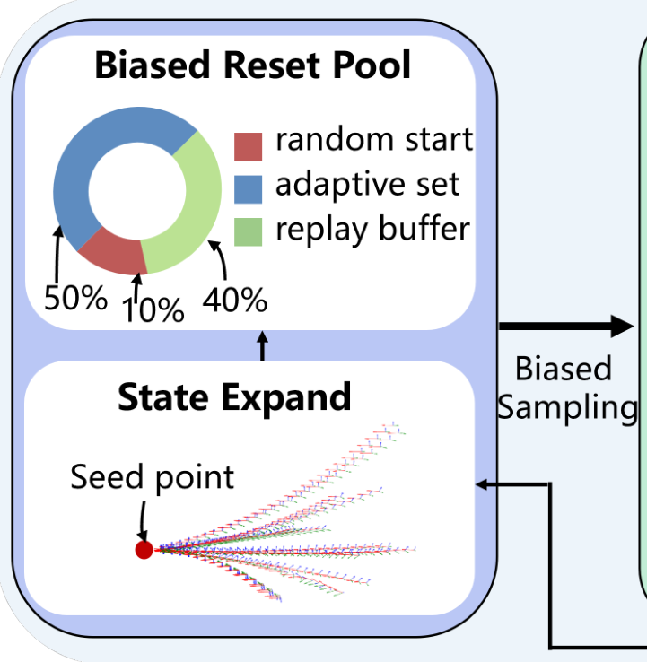

新方法必须提供：采样来源及混合权重；种子状态的定义；扩展过程与可行条件；样本如何进入训练管线。

重画步骤：

1. 用真实采样比例画组成图，未知比例不填源数字
2. 用作者真实扩展样本或明确示意分支呈现扩展
3. 将组成与生成过程放在同一模块中
4. 出口写明产生的状态/样本，而不是泛称 Data

迁移边界：迁移组成图加生成过程的组合表达；源图 50%/10%/40%、状态轨迹与飞行任务均不可当成新研究数据。

来源：`R20-F2`，PDF p4；裁框（左上原点 PDF pt）`[55, 55, 228, 232]`。哈希、路径和渲染信息见 `manifest.json`。


<a id="M07-reward-components"></a>
## M07-reward-components · 奖励拆分：把训练目标分成可定位、可消融的项

原图奖励条带以四个同层级卡片和加号展示 Reward Setting，读者可直接定位任务奖励、动作代价与姿态项。

适用条件：新方法确实采用加和型奖励或损失，且各项值得单独解释或消融。


新方法必须提供：完整奖励/损失表达式；各项符号、权重和单位；惩罚项正负号与优化方向；哪些项已有证据或需消融。

重画步骤：

1. 按真实公式确定卡片与运算符
2. 每项使用可与正文公式对应的短名称
3. 区分任务项与正则项并保持统一卡片层级
4. 若组合是乘积、门控或分阶段，改用对应关系，不能硬套加号

迁移边界：可迁移同层级条带及明确运算符；四项数量与源奖励定义不迁移。

来源：`R20-F2`，PDF p4；裁框（左上原点 PDF pt）`[175, 233, 558, 309.5]`。哈希、路径和渲染信息见 `manifest.json`。


<a id="M08-privileged-gradient"></a>
## M08-privileged-gradient · 特权分支与梯度：结构、前向和优化方向同时可读

原图用上方 Critic CNN 与下方 Actor CNN、GRU/MLP、状态支路及 PPO Loss 的虚线回传解释非对称训练；其下部也保留域分类分支的接口上下文。

适用条件：新方法存在 actor/critic 特权输入差异，或前向数据流和梯度路径需要区分。

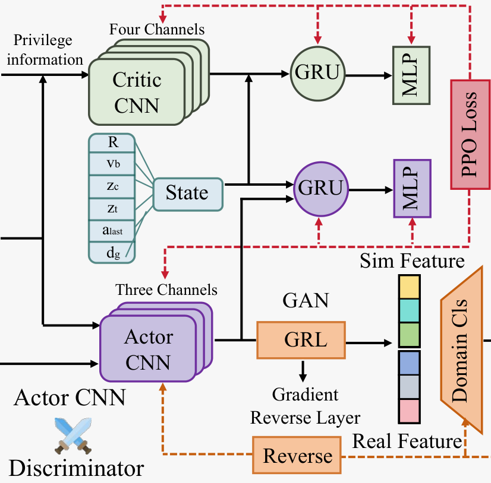

新方法必须提供：训练与执行各自可用观测；编码器、循环单元、融合和输出的实际连接；参数共享或独立关系；各损失更新哪些参数，以及停止/反转梯度位置。

重画步骤：

1. 先按实际输入权限划分两条分支
2. 用模块特征形状区分编码、记忆和输出
3. 先完成黑色前向路径，再叠加有定义的彩色虚线梯度
4. 图注解释每种线型，逐条核对更新的参数集

迁移边界：只迁移分支对齐、编码器层叠形状与梯度线语法；CNN/GRU/PPO/GRL 必须确实存在，不能为接近源图而加入。

来源：`R23-F3`，PDF p4；裁框（左上原点 PDF pt）`[239.8, 58, 438, 253]`。哈希、路径和渲染信息见 `manifest.json`。


<a id="M09-domain-alignment"></a>
## M09-domain-alignment · 域对齐：域分类路径与分布示意互相解释

原图将 RGB 编码特征、GRL、Domain Cls、Classifier Loss 与 Sim/Real 分布示意放在同一局部，前向黑线和回传彩色虚线具有不同语义。

适用条件：新方法真实采用特征层域对齐或域分类目标，并有明确的训练路径。

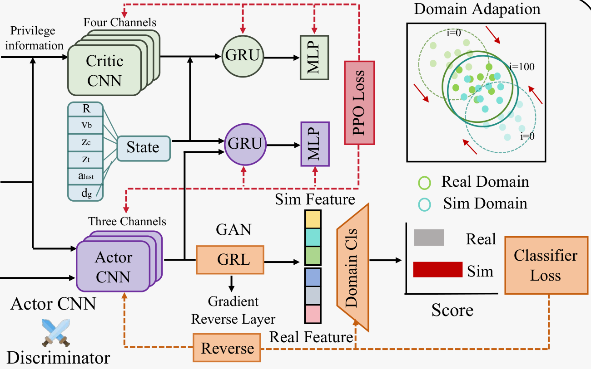

新方法必须提供：两个或多个域的定义及样本来源；被对齐的特征位置；对齐目标和梯度方向；域示意与实测嵌入图的区分。

重画步骤：

1. 画清产生特征的编码器与域分类出口
2. 根据真实优化过程画反向路径或停止梯度
3. 用一个小分布示意解释目标，不将其标为实验结果
4. 若展示真实嵌入，附方法、样本和数据来源

迁移边界：迁移网络加分布示意的解释组合；源域数据、GAN/GRL 设计、迭代编号及分布结果不能照搬。与 M08 的裁框部分重叠是为了保留接口。

来源：`R23-F3`，PDF p4；裁框（左上原点 PDF pt）`[239.8, 58, 552, 253]`。哈希、路径和渲染信息见 `manifest.json`。


<a id="M10-encoder-fusion"></a>
## M10-encoder-fusion · 编码与融合：用形状差别表达不同模块职责

原图用梯形 CNN、圆角 GRU、楔形 MLP、加和节点、状态向量与深度缩略图表达非对称网络；Add Noise 与 Dropout 标在它们真正作用的路径上。

适用条件：新方法有可确认的多模态编码、融合/记忆单元以及训练扰动。

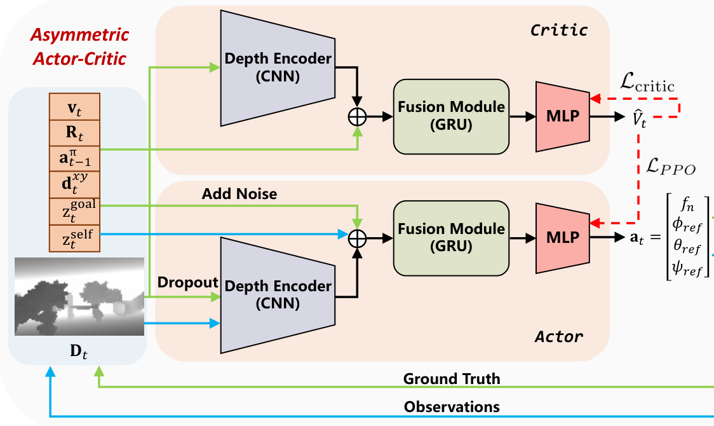

新方法必须提供：输入张量和状态变量；各编码分支与融合操作；记忆/循环模块是否存在；噪声、dropout 的作用位置与训练/执行权限；动作或值输出的分量。

重画步骤：

1. 先绘实际计算图与融合节点
2. 以形状家族区别编码、融合和输出，而不都用等大圆角框
3. 将向量分量放在紧凑输入列中
4. 只在真实路径标训练扰动，最后核对推理时可用的观测

迁移边界：迁移模块的形状词汇、层级与接口标签方式；源网络结构、向量分量与扰动设计不构成新方法的证据。

来源：`R25-F1`，PDF p3；裁框（左上原点 PDF pt）`[49.5, 57, 319, 217.5]`。哈希、路径和渲染信息见 `manifest.json`。


<a id="M11-train-deploy"></a>
## M11-train-deploy · 训练与部署：两条闭环及部署专用安全接口

原图用绿色仿真训练与青色实际部署路径区分控制接口、环境反馈和 HOCBF Filter，右侧图例给出训练、部署、前向和反向的线型含义。

适用条件：新方法的仿真训练与实机部署管线存在需要说明的差异，尤其安全过滤器或控制接口的差异。

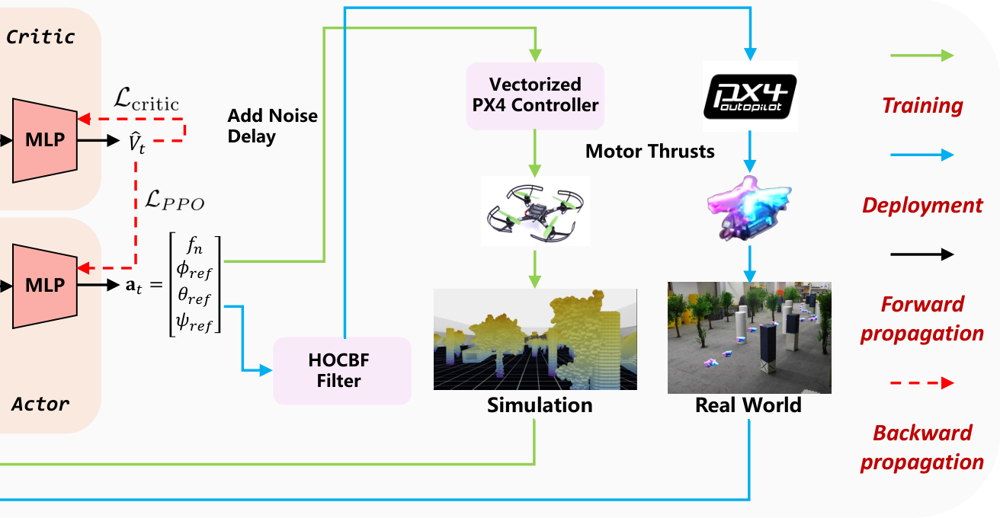

新方法必须提供：实际输出给控制器的动作；仿真与实机控制链；两种反馈观测的差异；安全过滤器是否存在及作用位置；真实仿真/硬件素材；缺失时允许明确示意。

重画步骤：

1. 分别列出训练和执行闭环的真实节点
2. 为两类路径固定颜色并提供图例
3. 将部署专用模块放在它实际作用的接口上
4. 使用作者平台素材；方案阶段用明确标记的符号替代，并保留缺失项说明

迁移边界：迁移两条路径和图例语法；不得默认新研究使用 PX4、HOCBF、同类机器人、源仿真场景或源实机结果。

来源：`R25-F1`，PDF p3；裁框（左上原点 PDF pt）`[248, 56.8, 562.8, 219.8]`。哈希、路径和渲染信息见 `manifest.json`。


<a id="M12-functional-bands"></a>
## M12-functional-bands · 任务—规划—控制：功能带、变量接口与真实任务示意

原图软件面板用水平功能带组织任务、规划、控制，并用姿态/位置/电机变量和灰色接口线连接执行器与估计器；任务带中的小图展示能力类别。

适用条件：新方法涉及多个任务层、规划层与控制层，且系统结构值得展开。

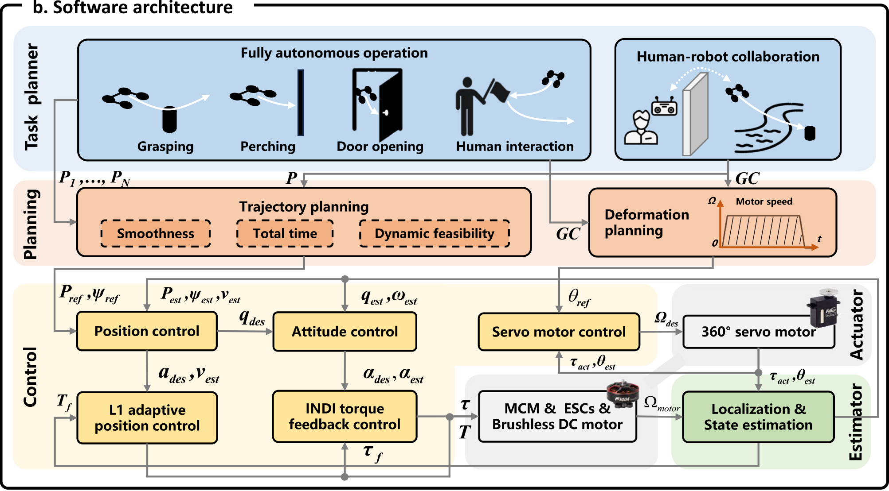

新方法必须提供：真实支持的任务能力；每层的输入/输出变量与单位；规划、控制、执行、估计的接口；真实控制算法与硬件；任务小图对应的行为定义。

重画步骤：

1. 先列层间接口，再决定功能带的高度
2. 将每个任务小图绑定到一项真实能力
3. 将控制和执行节点按信号方向排布
4. 统一变量与正文公式，检查分支、反馈和连接点

迁移边界：可迁移功能带、任务小图和接口变量的组织；抓取/栖停/开门、形变规划与 L1/INDI 等源功能不能默认进入新方法。Nature 的版面与字体规则不直接当作 IEEE 格式要求。

来源：`R29-F2-software`，PDF p4；裁框（左上原点 PDF pt）`[60, 230, 541, 496]`。哈希、路径和渲染信息见 `manifest.json`。


<a id="M13-serial-planning"></a>
## M13-serial-planning · 串行规划层：紧凑地表示可解释的三阶段依赖

原图在一个窄的淡蓝分组中纵向串联搜索、走廊生成和优化，层次清楚，适合单栏总览而不需要装饰性机制卡片。

适用条件：新方法的核心确实是按依赖关系串联的几步处理，且一列能够说明。

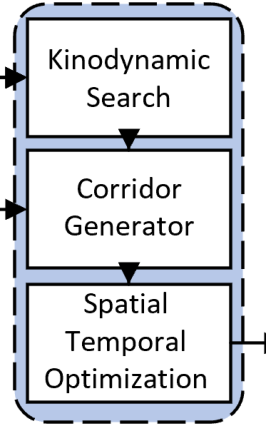

新方法必须提供：真实阶段及其顺序；各阶段输入/输出的中间表示；分组对应的功能边界；哪些阶段构成新贡献。

重画步骤：

1. 按真实依赖排序阶段
2. 以薄线和窄间距形成连续流程
3. 用一个外围分组表示同一功能，不再套多层框
4. 阶段数由新方法决定；必要时补输入/输出名

迁移边界：只迁移窄列串联与淡色功能分组；不能因源图三阶段就把新方法强行分成搜索、走廊与优化。

来源：`R01-F2`，PDF p2；裁框（左上原点 PDF pt）`[435.5, 67.5, 499, 172.8]`。哈希、路径和渲染信息见 `manifest.json`。

## 更新与核验

配方保存在 `recipes.json`。对照真实 PDF 和原图锚点调整边界后重新生成；裁框必须位于所记录锚点内。先检查每幅独立裁图的标签、外围上下文和接口，再将 `visual_review` 记为 `Viewed`。

```powershell
python scripts/prepare_mechanism_patterns.py
python scripts/prepare_mechanism_patterns.py --check
```

核验包括：唯一编号、源 PDF 哈希与页码、锚点内边界、已知 zone、裁图大小/非空、配方一致性及 PNG 哈希。`--check` 不生成或修改文件。已实际查看裁图只确认裁边和来源，不证明新图的科学内容或外观质量。
